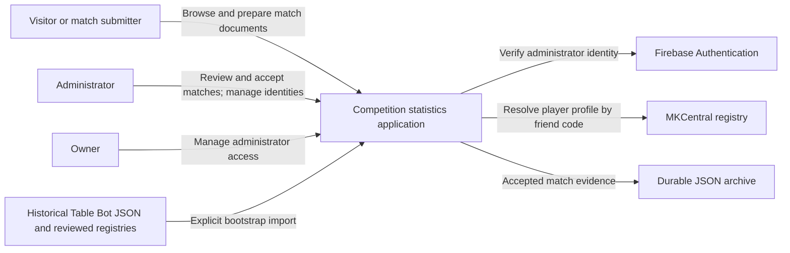
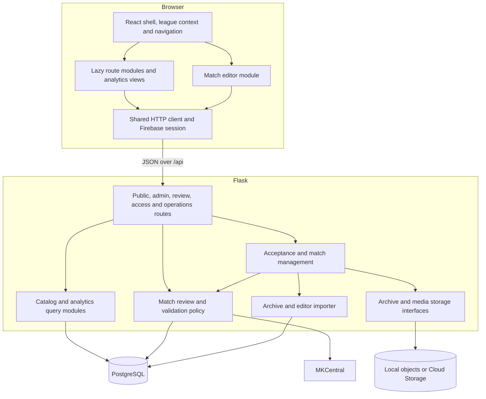
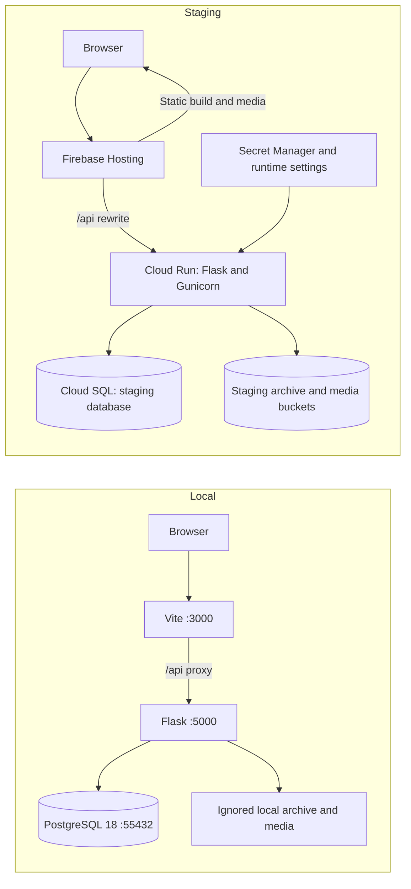
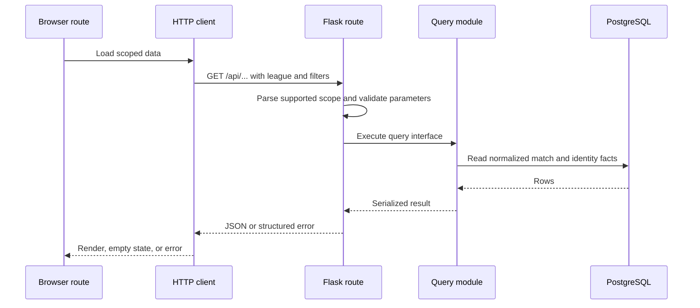
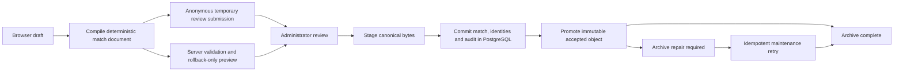

# Architecture

The application turns reviewed Mario Kart Wii match documents into league-scoped
statistics. React handles navigation, editing, and visualization; Flask owns
validation and authorization; PostgreSQL owns operational state; the accepted JSON
archive preserves durable match evidence.

Read the [domain glossary](../../CONTEXT.md) first. Continue with the
[repository map](repository-map.md), [frontend guide](frontend.md),
[backend guide](backend.md), [data model](data-model.md), and
[data pipeline](data-pipeline.md) for implementation detail.

## System context

Google sign-in establishes identity. An active application administrator record
establishes authority. Anonymous editing and public review submission do not confer
permission to import a match. See [ADR 0004](../adr/0004-administrator-access-and-public-review-queue.md).

## Runtime modules and stores

The browser never opens PostgreSQL or writes an accepted archive object directly.
Archive and media storage each have real local and GCS adapters. Keeping their
interfaces stable gives local tests leverage over hosted failure cases without
introducing another application tier.

## Local and staging deployment

Staging is the currently documented hosted environment. The deployment workflow
exists and targets staging; production cutover remains a separate planned step.
Staging and production are designed to use separate databases/roles and buckets,
initially on one Cloud SQL instance. Local work uses disposable local PostgreSQL.
See [deployment](../operations/deployment.md) and [production gates](../roadmap/README.md).

The checked-in configuration is authoritative for routing and build behavior:
[firebase.json](../../firebase.json), [Vite](../../frontend/vite.config.ts),
[Dockerfile](../../Dockerfile), [start.sh](../../start.sh), and
[CI/staging workflow](../../.github/workflows/ci-staging.yml).

## Read request

Some reads use the process-local Flask cache. Mutation routes clear that cache;
this is not distributed invalidation across every Gunicorn worker or Cloud Run
instance. Track analytics has its own regular/played-match eligibility rules;
other match-derived views commonly support the regular/playoffs/all match set.
See [backend](backend.md) and [methodology](../features/dashboard-analytics-methodology.md).

## Write ownership and recovery

PostgreSQL and object storage do not share a transaction. A successful database
commit can be followed by failed object promotion; the match remains committed,
and durable archive state records the repair requirement. Retrying is part of the
interface, not permission to create a second match. The [editor workflow](../json-editor/workflow.md)
records exact response states, duplicates, queue decisions, edits, and deletes.

## Stable seams

| Module | Interface callers learn | Implementation kept local |
| --- | --- | --- |
| Frontend HTTP client | Origin, JSON/errors, token attachment and request contracts | Fetch and authorization headers |
| Match editor | Draft editing and compile/preview/submit workflow | Scores, race arrays, warnings, entry decisions and editor views |
| Match review | Proposed-entry resolution and approval interpretation | Catalog/identity lookup, identity links and MKCentral review facts |
| Acceptance | One accepted-match operation with idempotent result | Transaction ordering, audit, archive staging and promotion |
| Archive storage | Queue/stage/read/promote operations | Local filesystem or GCS object behavior |
| Analytics queries | Scoped serialized statistics | Joins, role eligibility, aggregates and display names |

Preserve these seams when making changes. Splitting a long function into many
pass-through modules does not add depth. Keep a rule with the module that owns it,
and test through the interface used by real callers. Current constraints and
future work belong in the [roadmap](../roadmap/README.md), not hypothetical adapters.
