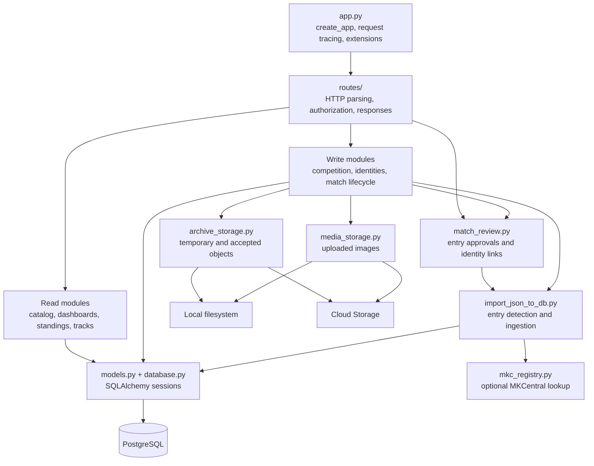
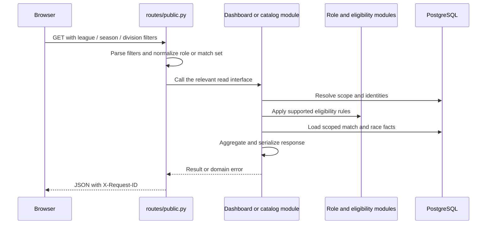
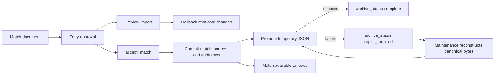
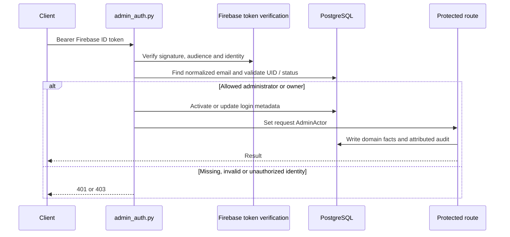

# Backend architecture

The backend is a Flask application with SQLAlchemy query and write modules,
PostgreSQL persistence, and explicit adapters for archived JSON and uploaded media.
Start at [app.py](../../backend/app.py), follow a route into its owning module,
then use the [data model](data-model.md) for its stored facts. The
[JSON editor guide](../json-editor/README.md) traces the complete editing and
acceptance workflow, including validation and data sources.

This describes repository behavior as of September 2026. Staging is the deployed
integration environment; the [deployment runbook](../operations/deployment.md)
and [production readiness plan](../roadmap/production-readiness-plan.md) distinguish
that environment from the future production cutover.

## Module map

Arrows show calls or imports. The archive and media seams each have two real
adapters: local disk for development and Cloud Storage for hosted environments.

The source layout is intentionally a flat Python module collection with a `routes/`
package. Commands run from `backend/`, or invoke a script under `backend/` so its
imports resolve there. Existing compatibility interfaces in `stats_db.py`,
`dashboard_stats.py`, `app.py`, and `routes/common.py` remain available. New
callers should use the owning implementation when they do not need compatibility.

### Composition and HTTP modules

| Source | Responsibilities and interface |
| --- | --- |
| [app.py](../../backend/app.py) | `create_app(config=None)` registers the five blueprints; enables compression; enables CORS only in local/test; assigns a request ID and logs method, path, status, duration, and actor. `app` is the WSGI entry point. |
| [extensions.py](../../backend/extensions.py) | Shared Flask-Caching object initialized by the factory; defaults to a process-local simple cache. Write routes clear it. It is not a distributed consistency mechanism. |
| [routes/public.py](../../backend/routes/public.py) | Public catalogs, identities, roster lookups, player/team/track analytics, standings, matches, playoff series, and uploaded logo content. |
| [routes/admin.py](../../backend/routes/admin.py) | Competition setup, alias/identity/logo management, MKCentral refresh, match preview/commit/edit/delete, database additions, and health review. Public preview and entry detection also live here; the filename alone does not imply authentication. |
| [routes/reviews.py](../../backend/routes/reviews.py) | Public queue submission/receipt, administrator submission/list/detail/claim/reject/accept. |
| [routes/access.py](../../backend/routes/access.py) | Authentication session, owner-managed application administrators, and access instructions. |
| [routes/operations.py](../../backend/routes/operations.py) | Public liveness, readiness, and aggregate data-health probes. |
| [routes/common.py](../../backend/routes/common.py) | Request argument parsing, match request envelopes, and common error responses; compatibility exports for the moved match-review functions. |
| [admin_auth.py](../../backend/admin_auth.py) | Verify Firebase token, resolve allowlisted administrator, enforce administrator/owner access, and record attributed audit events. |

`/api/matches/new-entries` and `/api/matches/preview` are public POSTs that may
perform reads and rolled-back imports. `/api/matches/commit` requires an
administrator. `/api/database-health`, its review actions, and database addition
history are also protected, despite lacking `/admin/` in their URLs. Check the
`require_admin` decorator on the actual route when changing authorization.

### Read modules

| Source | Owns |
| --- | --- |
| [stats_queries.py](../../backend/stats_queries.py) | Scope/identity resolution; season, division, team, player, and track directories; match and playoff-series lists; match-detail assembly. |
| [stats_db.py](../../backend/stats_db.py) | Legacy-compatible analytical entry points and query exports used by existing routes/tools. |
| [dashboard_stats.py](../../backend/dashboard_stats.py) | Compatibility exports for player/team dashboard interfaces. |
| [player_dashboard_stats.py](../../backend/player_dashboard_stats.py) | Dashboard scope resolution, player overview/performance/track metrics, shared team-logo resolution and dashboard errors. |
| [team_dashboard_stats.py](../../backend/team_dashboard_stats.py) | Team overview, roster, track metrics, and bulk counterpart summaries. |
| [track_analytics.py](../../backend/track_analytics.py) | Race-level track comparison/detail, including team score margins and player contributions. Its source query intentionally selects regular, played matches. |
| [standings_service.py](../../backend/standings_service.py) | Division/conference standings, inactive-team adjustments, tie-breaking, playoff seeds, and role leaderboards. |
| [player_role_analytics.py](../../backend/player_role_analytics.py) | Runner/bagger eligibility, coverage, confirmed 5v5 races, and counterpart metrics. |
| [analytics_eligibility.py](../../backend/analytics_eligibility.py) | Reviewed historical race-block exclusions shared by analytics queries. |
| [match_sets.py](../../backend/match_sets.py) | `regular`, `playoffs`, and `all` selection for the query interfaces that accept `match_set`. |
| [division_order.py](../../backend/division_order.py) | Consistent numeric ordering of division codes. |
| [player_display_names.py](../../backend/player_display_names.py) | Read-side names, choosing canonical names before ranked observed aliases. |
| [match_editor_catalog.py](../../backend/match_editor_catalog.py) | Scoped roster pool and known player memberships for the editor. |

Do not combine the two scope resolvers casually. The older `stats_queries.Scope`
requires a concrete season/division; `DashboardScope` also represents all seasons
or all divisions. Their defaults and validation are part of their interfaces.

See [analytics methodology](../features/dashboard-analytics-methodology.md) for scoring formulas and
[the data model](data-model.md#match-set-analytics-contract) for match selection.
A canonical player, a player season entry, and a match player represent different
facts; queries must preserve those distinctions when grouping results.

### Write and integration modules

| Source | Owns |
| --- | --- |
| [competition_setup.py](../../backend/competition_setup.py) | Creation and editing of seasons, divisions/conferences, teams, and team season entries. |
| [team_competition.py](../../backend/team_competition.py) | Active/dropped/disqualified status and reason for a team season entry. |
| [alias_management.py](../../backend/alias_management.py) | Player/track/team alias operations, player friend codes, player and track merge workflows. |
| [team_identity_management.py](../../backend/team_identity_management.py) | Canonical and scoped team identity, explicit league links, entry removal, and team merge workflows. |
| [team_logo_management.py](../../backend/team_logo_management.py) | Image validation/normalization, upload/reuse, scoped activation, and logo serialization. |
| [player_naming.py](../../backend/player_naming.py) | Canonical player-name priority and observed alias updates. |
| [mkc_registry.py](../../backend/mkc_registry.py) | Retried, bounded MKCentral lookup by exact Mario Kart Wii friend code, with explicit found/not-found/ambiguous/failure results. |
| [mkc_name_sync.py](../../backend/mkc_name_sync.py) | Persisted, expiring MKCentral refresh previews and administrator apply/reject decisions. |
| [match_results.py](../../backend/match_results.py) | Played/free-win/mutual-tie metadata rules. |
| [playoff_service.py](../../backend/playoff_service.py) | Playoff metadata, locked division format, series participants, sequence, clinching, and finals eligibility. |
| [import_json_to_db.py](../../backend/import_json_to_db.py) | Historical archive traversal and registries; catalog resolution; proposed entry detection; conversion of one match document into relational facts. |
| [match_review.py](../../backend/match_review.py) | Entry approval policy used by preview, acceptance, and replacement; safe identity-link derivation, MKCentral profile reuse, and duplicate receipts. |
| [match_upload.py](../../backend/match_upload.py) | Canonical JSON bytes, fingerprints, archive paths, committable validation, duplicate/conflict detection, addition capture/logging, and local archive reconciliation. |
| [review_queue.py](../../backend/review_queue.py) | Queue validation, acknowledged warnings, size/rate/duplicate controls, temporary objects, and public/admin receipt serialization. |
| [acceptance_service.py](../../backend/acceptance_service.py) | `accept_match(...)` owns the accepted-match transaction, idempotency, attributed logs, and post-commit archive promotion. |
| [match_management.py](../../backend/match_management.py) | Match inventory, replacement/deletion, provenance recomputation, audit-link preservation, and archive-history keys. |
| [archive_storage.py](../../backend/archive_storage.py) | Immutable archive object interface with local and Cloud Storage adapters. |
| [media_storage.py](../../backend/media_storage.py) | Safe-key, create-only media object interface with local and Cloud Storage adapters. |
| [bootstrap_archive.py](../../backend/bootstrap_archive.py) | Promote imported historical sources into accepted object storage. |
| [phase3_maintenance.py](../../backend/phase3_maintenance.py) | Expire submissions/rate limits and repair committed matches whose archive promotion failed. |
| [database_health.py](../../backend/database_health.py) | Detect integrity, catalog, scoring, role, archive, and analytics concerns. |
| [database_health_reviews.py](../../backend/database_health_reviews.py) | Read/write review dispositions for health finding keys; a disposition does not repair the fact. |
| [database.py](../../backend/database.py), [models.py](../../backend/models.py) | Environment/connection configuration and relational persistence definitions. |

The match-review module accepts an existing SQLAlchemy session and returns
`(new_entries, unapproved, player_identity_links, team_identity_links)`.
It does not commit. Preview, acceptance, and replacement cross the same seam and
therefore apply the same identity/approval rules. The extraction from
`routes/common.py` removes the workflow dependency on the HTTP adapter while
preserving the existing callable interface and compatibility imports.

## Transaction and storage ownership

A preview uses the same importer inside a transaction that is explicitly rolled
back after match-detail serialization. An accepted match commits PostgreSQL first;
object promotion happens afterward. A promotion failure returns HTTP 202 with
`archive_status=repair_required`, leaving the committed match available. This is
intentional cross-system recovery behavior, not a failed database write.

`match_management.replace_match` participates in its caller's transaction. Its
preview caller rolls back; its save caller stages the replacement/history objects,
commits the replacement, then promotes the new accepted object. Deletion previews
inventory owned rows and retained references; actual deletion removes match-owned
facts and recomputes provenance, while retaining shared catalog identities. See
the [editor guide](../json-editor/README.md) for exact request fields, fingerprints,
validation, and review transitions.

SQLAlchemy session factories are currently created in several owning modules.
A caller-supplied `session` enables preview queries to see uncommitted facts; do not
open another session halfway through that transaction. Pool settings apply per
engine, not as a process-wide connection cap. Broad session unification would be
a separate refactor because tests and tools patch these existing interfaces.

## Authentication and operations

The local/test development-header override requires `ALLOW_DEV_AUTH=true` and an
allowlisted user; hosted environments cannot use it. Application administrator
roles, database read access, repository permissions, and cloud IAM are separate
capabilities. Provider grants are not issued by the application.

The three public health probes have deliberately different meanings:

| Path | Meaning |
| --- | --- |
| `/api/health/live` | Process can return a response; no database read. |
| `/api/health/ready` | Database responds and `alembic_version` equals the repository head. |
| `/api/health/data` | Aggregate match count/latest import/archive repair count, without private findings. |

Detailed health and addition history require authentication. The old
`/api/database-additions/stream` path now returns HTTP 410 directing clients to
bounded polling; it is not a live event-stream implementation.

## Maintenance and verification

[Backend script reference](../../backend/scripts/README.md) records each executable
maintenance command and whether it writes. [Migrations](../../backend/migrations/README.md)
are the only deployed schema-change path; startup and imports do not create tables.
Checked-in [JSON](../../backend/JSON/README.md) and `backend/data/` registries support
historical rebuilds. PostgreSQL serves normal application reads.

Behavior tests are next to backend modules (`test_*.py`), with disposable
PostgreSQL schemas from [test_support.py](../../backend/test_support.py). Tests
resolve `TEST_DATABASE_URL` or the explicit local development URL, instead of
inheriting a staging `DATABASE_URL`. Existing integration coverage exercises the
HTTP interfaces, identity decisions, preview rollback, accepted archive retry,
match replacement, and analytics.

Use [contributor instructions](../../CONTRIBUTING.md) and
[project.md](../../project.md) for the complete required checks. A change to an
import or shared approval rule needs the editor/identity and acceptance tests as
well as the full final suite. Future production work should retain the storage,
authentication, and migration decisions in [the ADR index](../adr/README.md);
this module map describes implemented behavior, not an authorization to deploy.
