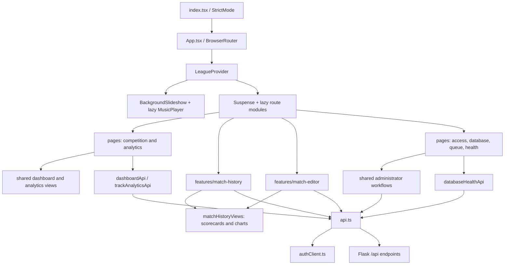
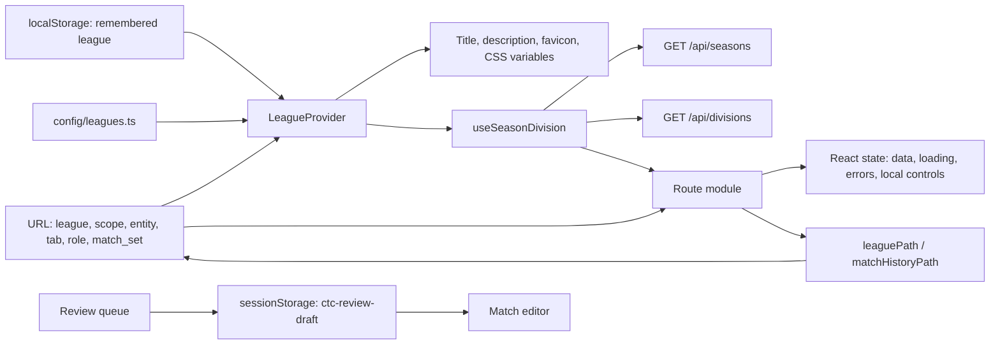
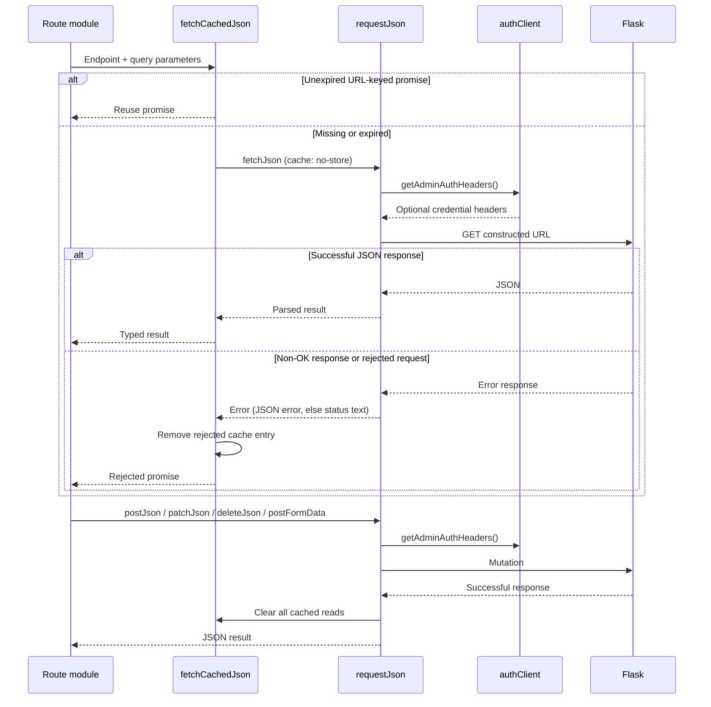
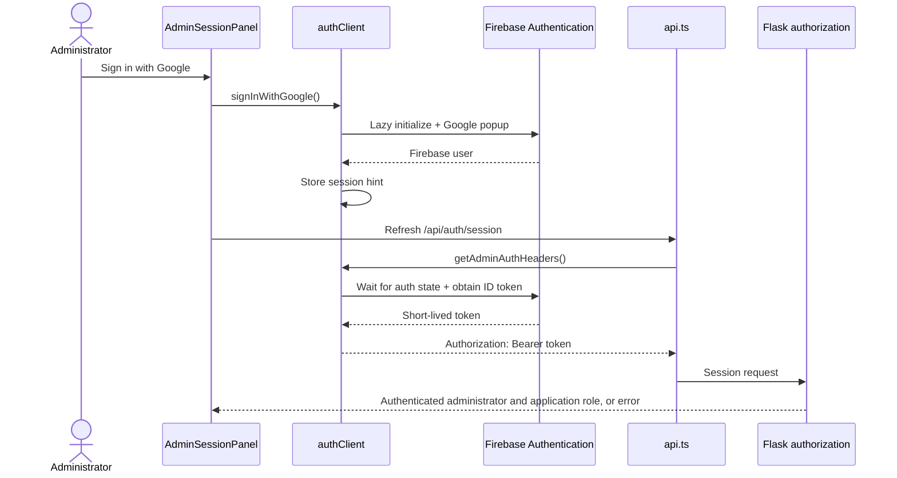
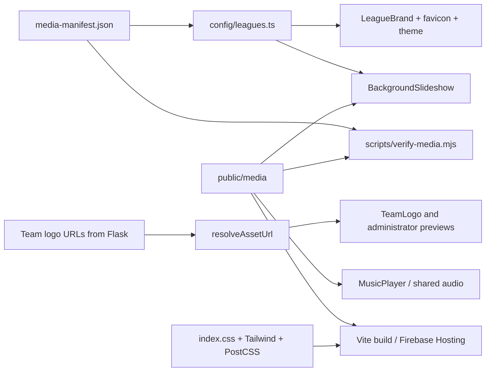

# Frontend architecture

The browser application is a static React 19 and TypeScript single-page
application. React Router chooses lazy route modules; Flask supplies the data.
Vite builds the application, Tailwind and PostCSS compile its styles, and
Playwright exercises the browser flows. There is no server-rendered React tier.

Start with the [system overview](README.md), [domain glossary](../../CONTEXT.md),
and [local startup guide](../development/local-development-startup.md). For the
complete match entry workflow, use the
[JSON editor guide](../json-editor/README.md).

## Module map

Paths in this table are relative to [`frontend/src/`](../../frontend/src/).

| Module | Responsibility and useful entry points |
| --- | --- |
| [`index.tsx`](../../frontend/src/index.tsx), [`App.tsx`](../../frontend/src/App.tsx) | Mount React Strict Mode, browser routing, league context, route loading fallback, and global media. |
| [`config/`](../../frontend/src/config/) | League branding and media counts, navigation groups/back destinations, and shared match-set values and URL parsing. |
| [`context/LeagueContext.tsx`](../../frontend/src/context/LeagueContext.tsx) | Selected league, URL propagation, remembered league, document metadata, favicon, and CSS theme variables. |
| [`hooks/useSeasonDivision.ts`](../../frontend/src/hooks/useSeasonDivision.ts) | Fetch season/division choices and resolve an initial selection for the selected league. |
| [`pages/`](../../frontend/src/pages/) | Route orchestration: request state, filters, selection, and page-specific views. |
| [`features/match-history/`](../../frontend/src/features/match-history/) | Match list/detail orchestration, shared scorecards/charts/types, and match-detail URL construction. |
| [`features/match-editor/`](../../frontend/src/features/match-editor/) | Match document editing, normalization, validation, identity/roster selection, review, submission, and upload. |
| [`components/dashboard/`](../../frontend/src/components/dashboard/) | Shared dashboard shell, entity navigator, scope controls, metrics, trends, and player/team tab views. |
| [`components/analytics/TablePagination.tsx`](../../frontend/src/components/analytics/TablePagination.tsx) | Pagination state/controls and browser CSV export used by track analytics. |
| [`components/admin/`](../../frontend/src/components/admin/) | Competition setup, match management, team identity, and team logo workflows used by database management. |
| [`components/`](../../frontend/src/components/) | Reused presentation such as navigation, branding, scope selectors, match-set/role toggles, administrator sign-in, competition status, and media. |
| [`api.ts`](../../frontend/src/api.ts) | Shared HTTP request implementation, cached reads, mutations, asset URL resolution, and common catalog/identity contracts. |
| [`dashboardApi.ts`](../../frontend/src/dashboardApi.ts) | Typed player/team dashboard reads and match-set prefetching. |
| [`trackAnalyticsApi.ts`](../../frontend/src/trackAnalyticsApi.ts) | Typed track list and individual-track analytics reads. |
| [`databaseHealthApi.ts`](../../frontend/src/databaseHealthApi.ts) | Detailed health reports and review decisions. |
| [`authClient.ts`](../../frontend/src/authClient.ts), [`hooks/useAdminSession.ts`](../../frontend/src/hooks/useAdminSession.ts) | Lazy Firebase initialization, credential headers, sign-in/out, and server-confirmed application authorization. |

The feature folders group concepts that callers use together. The match editor
imports the scorecard views directly from match history; it does not load the
match-history route merely to obtain its presentation. Shared modules are
imported directly, without a barrel that pulls unrelated route implementations
into the initial bundle.



## Route ownership

[`App.tsx`](../../frontend/src/App.tsx) is the authoritative route list.
[`config/navigation.ts`](../../frontend/src/config/navigation.ts) owns navigation
labels, grouping, active-link matching, and back-link destinations. Update both
when introducing a navigable route. There is currently no catch-all route.

| URL | Route module | Purpose |
| --- | --- | --- |
| `/` | `pages/HomePage.tsx` | League landing page and navigation. |
| `/standings` | `pages/StandingsPage.tsx` | Regular-season standings, competition status, and playoff presentation. |
| `/players`, `/teams` | `pages/DashboardDirectories.tsx` | Scoped directories; named exports are adapted for lazy loading. |
| `/players/:playerId` | `pages/PlayerDashboard.tsx` | Overview, performance, and tracks for a player. |
| `/teams/:teamId` | `pages/TeamDashboard.tsx` | Overview, roster, and tracks for a team. |
| `/stats` | `pages/PlayerStats.tsx` | Player statistics, role, and track comparison. |
| `/top-team-players` | `pages/TopTeamPlayers.tsx` | Player contributions and track statistics for a team. |
| `/best-matchups` | `pages/BestMatchups.tsx` | Team/opponent comparison. |
| `/tracks` | `pages/TrackAnalyticsPage.tsx` | Track frequency, timing, margins, and team strengths. |
| `/tracks/:trackId` | `pages/TrackDashboard.tsx` | A track's distribution, player/team results, and recent races. |
| `/matches` | `features/match-history/MatchHistory.tsx` | Match selection, scorecards, race order, and score charts. |
| `/json-editor` | `features/match-editor/MatchJsonEditor.tsx` | Anonymous editing/submission and authorized acceptance/editing. |
| `/admin/access` | `pages/AdminAccessPage.tsx` | Sign-in, administrator tool links, access instructions, and owner-only administrator management. |
| `/admin/database` | `pages/AdminAliasManagementPage.tsx` | Alias/identity management, competition setup, team logos, and stored-match management. |
| `/admin/review-queue` | `pages/AdminReviewQueuePage.tsx` | List, inspect, claim, reject, and open review submissions. |
| `/database-health` | `pages/DatabaseHealthDashboard.tsx` | Authorized record-level health findings and review state. |
| `/top-tracks` | `Navigate` | Compatibility redirect to `/tracks`. |
| `/admin/aliases` | `Navigate` | Compatibility redirect to `/admin/database`. |

The database-management filename retains its original alias-management name,
but the route now hosts several administrator workflows. The old standalone
`TopTracks` implementation was unreachable after the redirect and has been
removed; its server endpoints remain available.

## Browser state and navigation

There is no Redux store or global query library. State has three distinct homes:
URL parameters for shareable selection, React state for active forms and loaded
results, and browser storage for a remembered league/authentication hints and a
review handoff. Do not infer that all page filters persist to the URL: the older
statistics pages also have local selections.



### League and competition scope

- A valid `league` URL parameter wins over the remembered league. Otherwise the
  remembered valid code is used, falling back to `gsc`. The provider writes the
  chosen code into URLs that lack a valid league and persists it under
  `mkw-stats:league:v1` when storage is available.
- Changing league retains the pathname but clears `season`, `division`, `match`,
  `team`, `team_id`, `opponent_team_id`, `track`, `track_id`, and `edit_match`.
  Other parameters remain. `leaguePath()` adds the current league to a link.
- `useSeasonDivision()` loads seasons first and divisions after season selection.
  It honors an initial code only if returned by the server; otherwise it chooses
  the first available entry. Its optional all-seasons/all-divisions mode maps an
  initial `all` sentinel to the empty selection. Track analytics uses that mode.
  Directory and older statistics pages use the default concrete-scope mode.
- Player/team dashboards read their own scope from the URL and use the dashboard
  response's available appearances for selection. Their scope behavior is not
  identical to `useSeasonDivision()`.
- [`config/matchSets.ts`](../../frontend/src/config/matchSets.ts) is the single
  definition of `regular`, `playoffs`, and `all`. `parseMatchSet()` preserves the
  existing fallback to `regular` for missing or unrecognized URL values. The
  visible toggle and all prefetch loops use this same domain type.
- `matchHistoryPath()` includes season, division, match ID, and a non-default
  match set. Callers use `leaguePath()` to add league. If the requested match is
  outside the current result list, match history fetches its detail and replaces
  the URL with that match's actual competition scope.

### Asynchronous results

Pages own loading/error presentation and the effects that issue requests. Many
request effects use a cancellation flag to ignore late results after a selection
changes. This ignores a stale response; it does not abort the HTTP request.
Player/team dashboard tabs also use query keys to associate cached results with
specific filters. Preserve each route's key and reset behavior when changing its
implementation; collapsing all routes into one generic data hook would erase
meaningful differences in their interfaces.

## HTTP reads, caching, and mutations

[`api.ts`](../../frontend/src/api.ts) is the common request seam. Callers provide
an endpoint, query parameters, and the expected response type. Query construction
omits empty strings and `undefined`, retaining numeric zero. The type parameter
is a TypeScript contract, not runtime JSON schema validation.



`fetchCachedJson()` retains in-flight/resolved promises in a module-level map,
keyed by the full generated URL. Its default lifetime is five minutes from
request creation. A rejected promise is removed. Successful requests with an
explicit non-GET method clear the map, including validation POSTs. Sign-in and
sign-out do not directly clear it, and it is not a persistent or account-keyed
cache. Sensitive administrator and health reads use uncached `fetchJson()`.

The player/team dashboard request module prefetches alternate match sets with
`Promise.allSettled`; older statistics views use `prefetchMatchSetVariants()`.
These are existing eager reads, not a separate persistent cache. Track analytics
uses uncached requests and its current response contract reports regular-season
matches. Metric formulas and exclusions belong to the
[analytics methodology](../features/dashboard-analytics-methodology.md), not to
frontend rendering.

A non-OK response becomes an `Error` using its JSON `error` property when
available, then HTTP status text or `Request failed`. Route modules select their
own message and recovery UI. Network and parsing failures propagate to callers.

## Administrator authentication and review handoff

[`authClient.ts`](../../frontend/src/authClient.ts) lazily imports Firebase only
when sign-in or an existing-session hint needs it. Ordinary anonymous reads do
not initialize Firebase. [`useAdminSession()`](../../frontend/src/hooks/useAdminSession.ts)
requests `/api/auth/session` and owns its local loading/session state; each caller
has its own hook instance. `AdminSessionPanel` refreshes that state after sign-in
or sign-out.



The local-storage hint (`ctc-firebase-admin-session`) is not a credential or an
administrator grant. The server verifies the identity and application role. An
owner may manage administrator users; administrators can review/import matches
and use the restricted operational pages. Client rendering gates improve the
workflow but do not enforce authorization.

For local development only, `VITE_ALLOW_DEV_AUTH=true` enables storing an email
under `ctc-dev-admin-email` and sending `X-Dev-Admin-Email`. The backend must also
be configured to accept that development mode. Hosted builds require the
Firebase settings in the
[environment guide](../operations/environment-and-secrets.md). These rules follow
[ADR 0003](../adr/0003-firebase-administrator-authentication.md) and
[ADR 0004](../adr/0004-administrator-access-and-public-review-queue.md).

The review queue fetches a selected submission before handing its match document,
filename, and submission ID to the editor via `sessionStorage` key
`ctc-review-draft`. Navigation includes `review_submission` and the submission's
league. This is a browser handoff, not the durable queue; the server retains queue
state and the editor's acceptance path revalidates the match document. Detailed
state transitions and all validations are in the
[JSON editor guide](../json-editor/README.md).

## Media, theme, and styling



League-specific logos and numbered WebP backgrounds live under
`public/media/leagues/{league}`; shared MP3s live under `public/media/audio/shared`.
The manifest supplies background counts. `verify:media` checks required logos,
contiguous background names/counts, and the expected audio inventory. These are
intentional product assets, not disposable build output.

The global slideshow selects a random background on league change and, with at
least two images, a different random image every 15 seconds. Music starts paused,
chooses from the shared track list, and enables playback only after interaction;
the audio element uses `preload="metadata"`. Both remain mounted around route
changes. The initial HTML resolves the favicon before React boots, then the
league provider maintains it. Keep those two league-resolution behaviors aligned.

Team logos are server-managed assets. `resolveAssetUrl()` resolves `/api/` paths
against the configured server origin while leaving other paths unchanged. The
[logo workflow](../features/team-logo-management.md) supports a default logo,
season-specific overrides, historical assets, and reactivation.

## Builds, checks, and staging

The frontend package owns application dependencies and commands. The repository's
separate root package owns Firebase deployment tooling. From `frontend/`:

```bash
npm ci
npm run dev
npm run check
npm run build
npm run verify:media
npm run test:e2e
```

- `check` runs Biome and strict TypeScript checking. `format` formats supported
  source files; it does not run all checks.
- Vite reads `index.html`, emits `build/`, and creates a shared React/router vendor
  chunk. All route modules and the global music module are lazy loaded. Sourcemaps
  are disabled for production output.
- The default dev server uses port 3000 with an `/api` proxy to port 5000.
  Checked-in `.env.development` sets `VITE_API_URL=http://localhost:5000`, which
  sends local requests directly to Flask instead of using the proxy. An explicit
  environment override can use the proxy. The actual request base is always
  `VITE_API_URL || window.location.origin`.
- Production's checked-in environment does not hard-code a server origin.
  [`firebase.json`](../../firebase.json) currently rewrites `/api/**` to
  `ctc-stats-api-staging` in `us-central1` and all other application paths to
  `index.html`. Hashed assets, media, and HTML have distinct cache policies.
  This is staging configuration; production cutover still needs the deployment,
  domain, and environment work in the [deployment guide](../operations/deployment.md).
- Firebase browser configuration is baked in at build time. Reusing a staging
  bundle for another environment does not change those settings at runtime.
- Playwright starts Flask and Vite, reusing existing servers when available, and
  exercises desktop Chromium and Pixel 7 viewports. Install Chromium once with
  `npx playwright install chromium`; set `PYTHON_BIN` to the project interpreter.
  The smoke suite includes navigation, league selection, match-set transitions,
  administrator workflows, and editor regressions.
- `npm run baseline:ui` captures screenshots; it is not an automatic pixel-diff
  assertion suite. Preserve reviewed baseline evidence unless intentionally
  recapturing it.

## Changing this area

Locate a behavior through the route table, then follow its request module and
shared views. Keep route-specific async and form state near the route that owns
it; extract a module when a coherent concept has multiple callers or hides
meaningful workflow complexity. Maintain direct imports and lazy route loading.
Do not add a state framework, generic request adapter, or another route registry
without an actual varying requirement.

Use the existing browser smoke cases as the main interface-level regression
checks for moved routes and shared controls. The editor's pure normalization and
validation implementation still needs its workflow tests; relocating files alone
does not establish new behavioral coverage. Backend authorization, validation,
and scoring remain server responsibilities even when the frontend also checks or
previews them.
