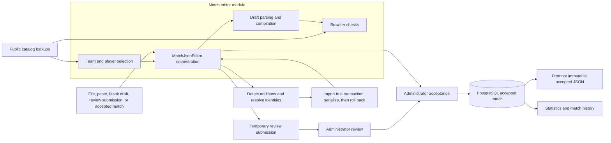

# JSON editor

The JSON editor turns a match document into a reviewed, reproducible database import. Local editing and server previews are public. A review submission stores a proposal; only an authenticated application administrator can accept a match into analytics. The database transaction commits before the accepted archive object is promoted.

## Reading order

1. [Workflow](workflow.md): loading, editing, entry approval, preview, queue submission, acceptance, correction, and recovery.
2. [JSON format and draft compilation](json-format.md): fields, score tables, substitutions, roles, disconnection awards, and missing-player awards.
3. [Validation reference](validation.md): every implemented check family, where it runs, and whether it blocks or warns.
4. [Data sources](data-sources.md): every editor lookup, database provenance, external lookup, and persistence destination.

Use the [domain glossary](../../CONTEXT.md) for names and the [database model](../architecture/data-model.md) for the complete relational schema. The [manual identity checklist](../development/json-editor-player-identity-test-checklist.md) supplements the automated tests.

## Architecture at a glance

## Source map

| Module | Interface and responsibility |
| --- | --- |
| [MatchJsonEditor.tsx](../../frontend/src/features/match-editor/MatchJsonEditor.tsx) | Route screen at `/json-editor`; owns draft state, effects, UI actions, approval decisions, preview/submit/edit sequencing. |
| [matchJsonEditorModel.ts](../../frontend/src/features/match-editor/matchJsonEditorModel.ts) | `parseMatchJson`, `racesFromMatch`, `compileMatch`; converts source JSON to editable races and back without network calls. |
| [matchJsonEditorValidation.ts](../../frontend/src/features/match-editor/matchJsonEditorValidation.ts) | `validation`, `playoffConsistencyIssues`, identity/track matching, issue and review response types. |
| [ExistingPlayerPicker.tsx](../../frontend/src/features/match-editor/ExistingPlayerPicker.tsx), [TeamScopePool.tsx](../../frontend/src/features/match-editor/TeamScopePool.tsx), [TeamRosterPool.tsx](../../frontend/src/features/match-editor/TeamRosterPool.tsx) | Editor-only selection UI; existing player search, scoped team choice, and previously recorded roster. |
| [api.ts](../../frontend/src/api.ts) | HTTP transport, authentication headers, catalog request/response types. |
| [matchHistoryViews.tsx](../../frontend/src/features/match-history/matchHistoryViews.tsx) | Shared preview rendering; the editor uses the same match detail presentation as history. |
| [routes/admin.py](../../backend/routes/admin.py) | Public detection/preview endpoints and administrator commit/edit routes. The filename does **not** mean every route requires authentication. |
| [match_review.py](../../backend/match_review.py) | Approval policy, explicit identity links, duplicate-player protection, and MKCentral profile handoff. |
| [match_upload.py](../../backend/match_upload.py) | Committable-document checks, canonical bytes/fingerprint, source naming, duplicates, and addition logs. |
| [import_json_to_db.py](../../backend/import_json_to_db.py) | Detect additions, resolve catalogs, and write match-owned records through the common importer. |
| [acceptance_service.py](../../backend/acceptance_service.py) | Revalidation, import transaction, idempotency, audit, and post-commit archive promotion. |
| [review_queue.py](../../backend/review_queue.py), [routes/reviews.py](../../backend/routes/reviews.py) | Queue validation, limits, receipts, claim/reject/accept state transitions. |
| [match_management.py](../../backend/match_management.py) | Inventory, rollback edit preview, transactional replacement with stable match identity, and provenance repair. |

The frontend files live together to keep the editor's implementation local. The route remains the external interface; model and validation functions are internal seams. There is no new generic form framework or separate copy of import logic.

## Verification

The editor's behavior is covered through the browser and server interfaces:

| Coverage | Existing tests |
| --- | --- |
| File/paste loading, free wins, team moves, missing metadata, substitution artifacts, reduced-room disconnections, playoffs, identity selection, preview and warnings | [frontend/e2e/smoke.spec.ts](../../frontend/e2e/smoke.spec.ts) |
| Player identity and roster reuse | [test_match_editor_players.py](../../backend/test_match_editor_players.py) |
| League/team entry approval and cross-league resolution | [test_match_upload_league_team_validation.py](../../backend/test_match_upload_league_team_validation.py) |
| Track league/alias rejection and lookup behavior | [test_track_league_validation.py](../../backend/test_track_league_validation.py) |
| Queue isolation, idempotent acceptance, archive failure, corrections, and authorization | [test_phase3_workflows.py](../../backend/test_phase3_workflows.py) |
| Playoff metadata, pairing, ordering, clinching, and historical gaps | [test_playoff_support.py](../../backend/test_playoff_support.py) |
| Role inference and explicit roles | [test_import_json_to_db.py](../../backend/test_import_json_to_db.py) |
| Correction summaries and archive cleanup | [test_match_management.py](../../backend/test_match_management.py) |
| Special result scores and conference scheduling | [test_standings.py](../../backend/test_standings.py) |

Run `npm run check` and `npm run build` from `frontend/`. With the local stack and Playwright browser installed, `npm run test:e2e -- --grep 'json editor|JSON editor'` selects the main editor scenarios. Use the repository's [development guide](../development/README.md) for the PostgreSQL-backed Python test environment; catalog/transaction tests require a database and must not use staging or production.

## Environment and future work

This reference describes repository behavior, not a claim that production cutover is complete. Keep local, staging, and production configuration separate. The editor uses the configured backend and its catalogs; it does not choose a database or storage bucket itself. Staging must continue to exercise authentication, review submissions, post-commit archive repair, and corrections before production rollout.

The accepted direction remains [ADR 0002](../adr/0002-postgresql-and-durable-json-archive.md) and [ADR 0004](../adr/0004-administrator-access-and-public-review-queue.md). The large route screen still owns coupled editing state; extracting a state machine or changing validation parity would be a separate behavior-sensitive change. This cleanup preserves current checks, including the explicitly documented differences between browser, queue, preview, and acceptance validation.
