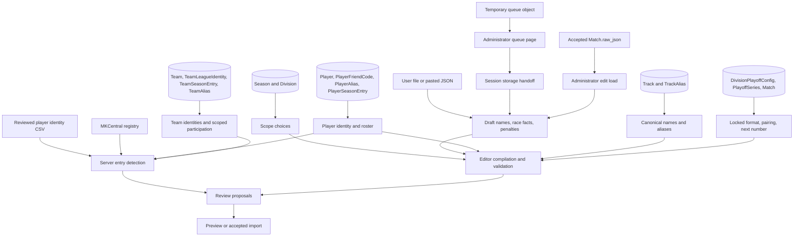
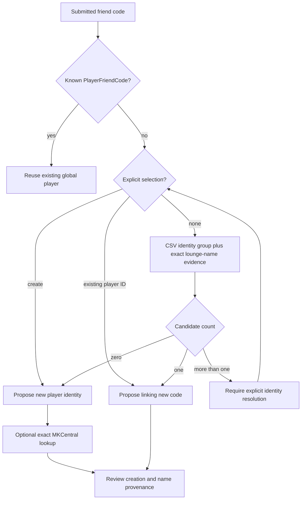

# JSON editor data sources and provenance

The match document supplies race facts. The application's PostgreSQL catalogs supply identity and competition context. MKCentral is a server-side enrichment lookup for unknown friend codes; the editor does not fetch live race results, download Table Bot tables, or query MKCentral directly.

Transport is defined in [frontend api.ts](../../frontend/src/api.ts). Public catalog routes are in [routes/public.py](../../backend/routes/public.py), query implementations in [stats_queries.py](../../backend/stats_queries.py), roster/membership queries in [match_editor_catalog.py](../../backend/match_editor_catalog.py), and database definitions in [models.py](../../backend/models.py).

## Provenance map

## Browser state and incoming match facts

| Source | What it supplies | Lifetime / precedence |
| --- | --- | --- |
| `blankMatch` in [model](../../frontend/src/features/match-editor/matchJsonEditorModel.ts) | Twelve blank races, two empty teams/colors, 5v5 defaults. | Cloned for initial/reset state; metadata still needs completion. |
| File/paste | Names, team keys/colors, tracks, placements, scores, roles, penalties, table references, and optional metadata. | Loaded into memory; file/paste applies selected site league. Compiled generated fields replace corresponding source values. |
| [LeagueContext](../../frontend/src/context/LeagueContext.tsx) and [league configuration](../../frontend/src/config/leagues.ts) | Supported site league selection. | Draft league follows current selection; backend catalog rules still apply. |
| `ctc-review-draft` in session storage | Queued document, filename, review submission ID from admin queue page. | Handoff only; reset/successful acceptance removes it. No continuous editor autosave. |
| Administrator management endpoint | Accepted original JSON, manifest, source fingerprint. | Loads only for authenticated `edit_match` route mode; used to reject stale corrections. |
| Editor interaction | Corrected scope/team/player fields, placements, awards, review notes, explicit identity choices. | React state until download, submission, acceptance, or reset. |

`rxx` entries are retained table references. They are not used to pull replacement race data. Historical `backend/JSON/` documents are not browser lookup catalogs: the archive importer ingests them separately, after which the editor queries the database.

## Read endpoints used by the editor

All paths below are relative to `VITE_API_URL`, or `window.location.origin` when unset. The shared transport includes available administrator authentication headers. These lookups use `fetchJson` with `cache: no-store`, rather than the analytics response cache.

| Request | Source records / code | Editor use and request timing |
| --- | --- | --- |
| `GET /api/match-scopes` | `Season` joined to `Division`; `list_match_scopes`. | All scope options/existence checks, once on mount and refreshed after commit. This lists configured scopes, not only scopes with matches. |
| `GET /api/team-scopes` | `Season`, `Division`, `TeamSeasonEntry`, `Team`; `list_team_scopes`. | All scoped team identities, names/tags, competition status; filtered to current scope in browser, fetched on mount and refreshed after commit. |
| `GET /api/track-search?league=...&include_other_leagues=true` | `Track` and `TrackAlias`; `search_tracks`. | Initial catalog when league changes; includes other leagues to detect mistaken league names. Query limits to 500 records by default. |
| `GET /api/track-search?...&query=<name>` | Same track query, case-insensitive partial name/alias search. | Additional search for draft track names missing from loaded catalog, once per normalized name per league load; merges returned track IDs. Validation uses exact normalized name/alias matching, not partial search result membership. |
| `GET /api/player-identities?friend_code=<code>` | Exact `PlayerFriendCode`, then `Player` and aliases/codes. If absent, server calls MKCentral. | For syntactically valid codes without identity state: one result confirms, none marks new, multiple/error marks conflict. |
| `GET /api/player-identities?query=<text>` | Numeric player ID or partial canonical name/alias search, normally at most 12 results. | Existing-player picker; debounced 200 ms; stale results canceled on query change. A returned candidate still needs explicit selection. |
| `GET /api/team-roster-pool?league=...&season=...&division=...&team_id=...` | Exact `TeamSeasonEntry`, its `PlayerSeasonEntry` rows, `Player`, and known friend codes. | Lazy load on opening a team's roster pool; reused while that pool remains mounted. |
| `GET /api/player-team-memberships?...&player_ids=<comma-separated IDs>` | `PlayerSeasonEntry` joined through team/season/division; unique team memberships per requested player. | Runs for configured player IDs only when selected scope exists; flags unusual team assignment. Endpoint allows at most 100 supplied IDs. |
| `GET /api/playoff-series?league=...&season=...&division=...` | Playoff configuration/series, participants, and match outcomes via [stats_queries](../../backend/stats_queries.py) / [playoff_service](../../backend/playoff_service.py). | Reloads when scope/edit target changes; locks format/best-of/pairing and computes next series match. |
| `GET /api/database-additions?limit=100` | `DatabaseAdditionLog`; includes administrator attribution. | Administrator-only; polls every 15 seconds while browser document is visible, merges by log ID, retains latest 100. |
| `GET /api/admin/matches/<id>/management` | [match_management.match_inventory](../../backend/match_management.py), accepted raw JSON and source metadata. | Administrator-only edit-mode load/reload; never available to anonymous users. |

The roster pool is historical participation, not an official live registration feed. Its preferred friend code is the latest seen code ordered by `last_seen_match_id`, then friend-code row ID, falling back to `Player.primary_friend_code`. Names come from the global player and that scoped participation's primary lounge/Mii names. A player already configured by ID or friend code is disabled in the pool.

Membership lookup similarly reports recorded participation in the chosen league/season/division. A player with no recorded teams is omitted from the response. The editor does not interpret missing history as a prohibited transfer.

## Identity resolution and names

[detect_new_entries](../../backend/import_json_to_db.py) consults these sources:

- Existing `PlayerFriendCode` ownership is authoritative for known codes.
- Explicit `player_identity_links` can select an existing player for an unknown code or request `create`; they cannot reassign a known code.
- [backend/data/player_identities.csv](../../backend/data/player_identities.csv) groups reviewed friend-code identities for legacy reconciliation. The importer resolves mapped codes to existing database players.
- Exact normalized lounge names are matched against canonical player names, historical participation names, and lounge aliases. Mii display similarity alone does not establish identity.
- Multiple candidate IDs remain a conflict until explicitly resolved.

The editor preserves raw Mii/lounge/table names in the match document. Canonical name selection happens in the backend, using [player_naming.py](../../backend/player_naming.py) and [player_display_names.py](../../backend/player_display_names.py). An unknown player's successful MKCentral lookup can provide the initial canonical name and stored aliases; match-local names remain source facts. Existing-player lookup does not automatically refresh all names from MKCentral; name synchronization is a separate administrative workflow.

Team identity resolution loads database `TeamAlias` / `TeamLeagueIdentity` records. Global `Team` is distinct from its league tag and its season/division presentation. A tag found only in another league is a candidate, not proof of shared organization. Historical CSV team-correction inputs belong to archive/bootstrap ingestion; live editor imports use database-managed aliases through `load_database_team_aliases`.

## MKCentral external lookup

[mkc_registry.py](../../backend/mkc_registry.py) calls the configured code's registry endpoint `https://mkcentral.com/api/registry/players` with `friend_code` and `detailed=true`. The backend filters returned profiles for the exact friend code with game type `mkw`; unrelated game registrations are not accepted as identity evidence.

| Outcome | Meaning |
| --- | --- |
| `found` | Exactly one profile with valid integer ID and nonblank name. |
| `not_found` | Successful response, no exact Mario Kart Wii friend-code profile. |
| `ambiguous` | Multiple exact profiles; candidate IDs returned for review. |
| `lookup_failed` | Request/JSON failure, unexpected payload shape, or invalid profile ID/name. |

Timeout is controlled by `MKC_API_TIMEOUT_SECONDS` (default 6 seconds, minimum 1); connection timeout is capped at 3.05 seconds. The session uses bounded retries for connection/read failures and 429/5xx responses. A failed lookup is distinguishable from a successful “not found.” Server entry detection, preview, and acceptance may repeat this lookup when enrichment is enabled; no successful network call is a guarantee that the following database transaction will commit.

## Requests that advance the workflow

| Request | Payload and effect |
| --- | --- |
| `POST /api/matches/new-entries` | Match plus optional `player_identity_links` and `team_identity_resolutions`; read/detect proposals, including MKCentral enrichment. Public. |
| `POST /api/matches/preview` | Match, identity choices, `approved_new_entries`; run importer transaction and roll back, return table plus fingerprint. Public. |
| `POST /api/review-submissions` | Match, original filename, `warnings_acknowledged`; public temporary queue only. |
| `POST /api/admin/review-submissions` | Same submission semantics with administrator audit and no anonymous rate limit. |
| `POST /api/matches/commit` | Match, approved keys, identity choices, `expected_preview_fingerprint`; administrator accepted import. |
| `POST /api/admin/review-submissions/<id>/accept` | Same reviewed match and choices; administrator accepts queued document, replacing temporary bytes if cleaned JSON changed. |
| `POST /api/admin/matches/<id>/new-entries` | Administrator correction detection, with old match removed inside rolled-back transaction. |
| `POST /api/admin/matches/<id>/preview` | Correction payload plus `expected_source_fingerprint`; replacement preview and change summary, then rollback. |
| `PATCH /api/admin/matches/<id>` | Both source and preview fingerprints plus reviewed payload; transactional correction retaining match ID. |

[Queue UI](../../frontend/src/pages/AdminReviewQueuePage.tsx) also uses administrator list/detail/claim/reject routes. Public `GET /api/review-submissions/<receipt>` returns status/timestamps/expiry only; it does not return the submitted JSON or administrator details.

## Persistence destinations

| Data | Destination | When written |
| --- | --- | --- |
| In-progress draft / approval choices | Browser memory | Editing only. |
| Review handoff | Browser session storage | Opening queue document in editor. |
| Queue JSON | Archive adapter `queue/pending/<uuid>.json` | Validated submission before queue-row flush. |
| Queue metadata | `ReviewSubmission`, `SubmissionRateLimit` | Submission; status/audit updated by administrator/maintenance. |
| Accepted match facts | `Match`, `MatchTeam`, `MatchPlayer`, `Race`, `RacePlayerResult`, `RaceTeamResult`, `Penalty`, `MatchTableRef` | Administrator acceptance transaction. |
| Approved shared catalog changes | Season/division/team/player/track identities and participation records | Same acceptance transaction via importer. |
| Source provenance | `SourceFile`, `Match.raw_json` | Acceptance transaction; archive status updated after promotion. |
| Audit | `DatabaseAdditionLog`, `AdminAuditLog` | Accepted import/correction and administrator queue actions. |
| Accepted JSON | Archive adapter `accepted/.../<label>--<hash-prefix>.json` | Promotion after commit. |
| Original corrected document | `replaced/matches/<id>/...` | Correction route preserves source before replacement. |

Local storage defaults to `backend/data/object_storage` or `ARCHIVE_STORAGE_ROOT`. Staging/production select GCS through `ARCHIVE_STORAGE_PROVIDER=gcs` and `ARCHIVE_GCS_BUCKET`; [archive_storage.py](../../backend/archive_storage.py) rejects local storage in those environments. This is separate from the repository's historical `backend/JSON` import corpus and its logical source-path naming.

The database and archive are authoritative for different facts: PostgreSQL decides whether a match was accepted; the archive stores its canonical audit document. Temporary queue objects never feed statistics. Staging and production must use their own configured database roles/databases and archive destinations; no client-side league choice or filename can select a different environment.
