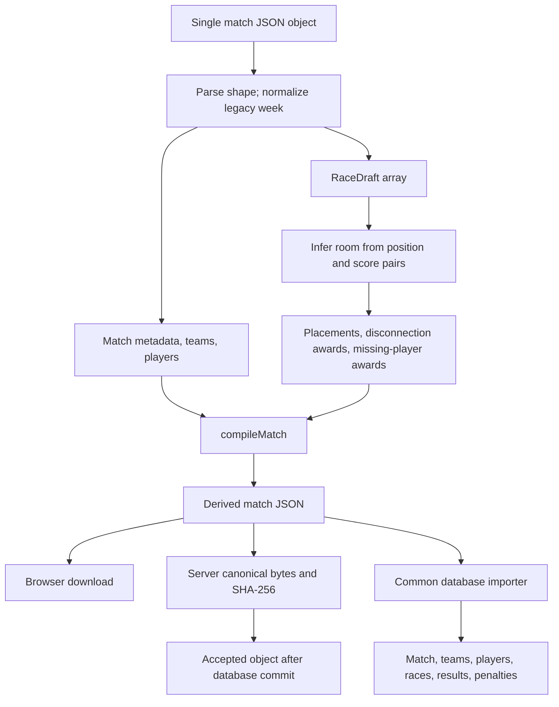
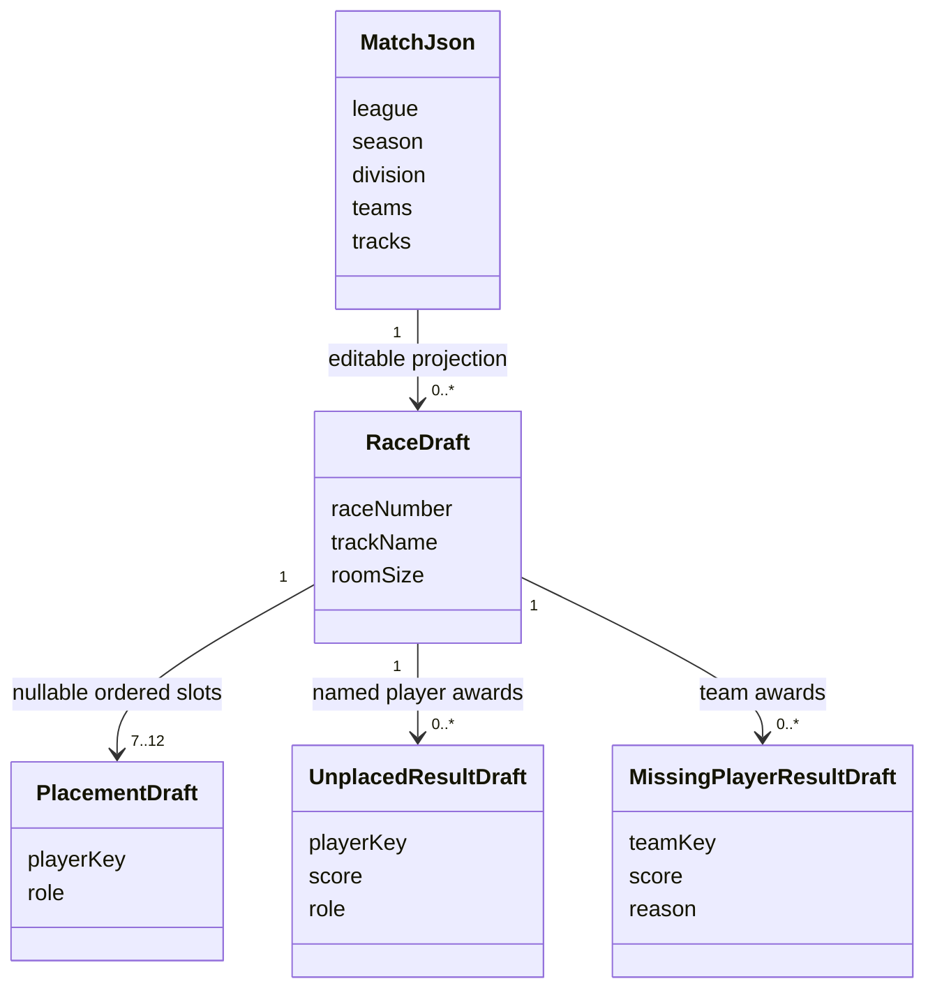
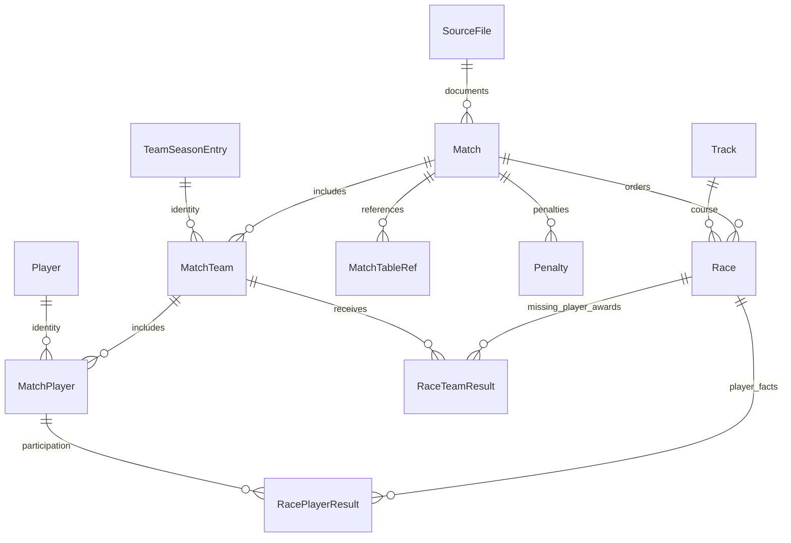

# Match JSON format and draft compilation

This reference describes the interactive editor's current document format. It replaces the earlier combined JSON/database design notes; the complete relational reference is [data model](../architecture/data-model.md). The implementation is [matchJsonEditorModel.ts](../../frontend/src/features/match-editor/matchJsonEditorModel.ts), with persistence in [import_json_to_db.py](../../backend/import_json_to_db.py).

## Documents, drafts, and database records



The editor accepts one object. The historical importer separately accepts either one object or a list of match objects and can derive scope/number metadata from archive folders and filenames. Do not pass a historical batch array directly to the editor. `.txt` historical files can contain JSON; file extensions do not change its structure.

Unknown top-level/team/player keys are generally retained by object spreads during normal played-match compilation, while generated fields below are replaced. This is not a strict JSON Schema validator. The special-result compiler intentionally constructs new team objects containing only its result fields.

## Match fields

| Field | Meaning and compilation behavior |
| --- | --- |
| `league`, `season`, `division` | Competition scope. The editor uses the selected site league; season/division metadata fields turn digits into `sN`/`dN`. Backend scope resolution trims and lowercases codes. |
| `match_type` | `regular` or `playoff`; omission is treated as regular by the server. |
| `match_number` | Positive regular-season number. Legacy numeric `week` is copied here only when absent, then removed from editor output. Playoff documents omit it. |
| `match_label` | Preserves an existing nonblank label; otherwise generated from regular match number and first two tags, or playoff stage/series/match. Special results append a result label. |
| `result_type` | `played`, `free_win`, or `mutual_tie`; omission is played server-side. |
| `free_win_winner` | Editor team key or tag identifying the 150-point team; meaningful for `free_win`. |
| `format` | Commonly `5v5`. A `NvM` string supplies expected room size `N+M`; `ffa` defaults to 12; other values fall back to 10. Only room sizes with a score table are selectable. |
| `playoff_format` | `three_team` or `four_team`, locked by division playoff configuration. |
| `playoff_stage` | `semifinals` or `finals`. |
| `playoff_series_number` | Positive integer; finals/three-team semifinal use 1; four-team semifinals use 1 or 2. |
| `series_match_number` | Number inside the playoff series. The editor assigns the next available number from existing series context. |
| `best_of` | Positive odd series length, default 3; existing series locks it. |
| `title_str` | Rebuilt as `#title <race count> races\n`. |
| `races_played` | Rebuilt from the race draft count. |
| `tracks` | Track names in compiled race order; arrays index the corresponding player race result arrays. |
| `rxx` | Table references; compiler trims each string and removes blank strings. Stored as ordered `MatchTableRef` records; not fetched as source race data by the editor. |
| `teams` | Object keyed by the compiled team tag, each holding team and player facts. |
| `review_notes` | Freeform review context retained with the document and combined with importer review notes. |

## Team and player fields

| Team field | Meaning |
| --- | --- |
| Object key / `table_tag_str` | Draft key is an internal identity; `teamTag` uses `table_tag_str` without its color when that field exists, otherwise the key. Compiled object is keyed by the resulting tag. |
| `hex_color` | Explicit color wins; otherwise parse the tag color, falling back to `#64748B`. Rebuilt into `table_tag_str`. |
| `players` | Object keyed by friend code in `0000-0000-0000` form. |
| `penalties` | Team points deducted from the compiled total; default zero. |
| `table_penalty_str` | Rebuilt as `Penalty -<points>` when nonzero, otherwise empty. |
| `total_score` | Sum of player totals plus missing-player awards minus team penalty. |
| `missing_player_results` | Detailed awards `{race_number, score, reason}` for a team without a player placement. Reasons: `short_roster`, `unreplaced_disconnect`, `unknown`. |
| `missing_player_scores` | Legacy-compatible aggregate score per race, or `null`; omitted when there are no awards. Detailed results take precedence when loading a race. |

| Player field | Meaning |
| --- | --- |
| Friend-code object key | Game identifier used to resolve the global player; not the database player ID. |
| `mii_name`, `lounge_name`, `table_name`, `flag` | Observed source names/flag. They may differ from the current canonical player name. |
| `tag` | Rebuilt from the compiled team tag. |
| `race_positions` | One-based finishing position per race, or `null`. |
| `race_scores` | Score-table points for a placement, explicit disconnection award for a positionless result, otherwise `null`. Zero is a real score. |
| `race_roles` | `runner`, `bagger`, or `null` per race. Explicit roles are preserved; assigned 5v5 placements default positions 1–8 to runner, later positions to bagger. |
| `gp_scores` | Compiled scores in consecutive chunks of four; a final short chunk is allowed. |
| `penalties` | Player points deducted after summing race scores. Legacy team-match player penalties warn in the UI. |
| `total_score` | Sum of race scores, treating null as zero, minus player penalty. |
| `had_penalties` | Rebuilt from whether penalty is nonzero. |
| `subbed_out` | True when the player has a placement and their last placed race occurs before the final race. This derived flag is not a complete attendance model. |
| `table_str` | Rebuilt from preferred table/lounge/Mii/friend-code label and GP totals joined by `|`. |

## Internal race state

A `RaceDraft` has `raceNumber`, `trackName`, `roomSize`, `placements`, `unplacedResults`, and `missingPlayerResults`. The player key is `<draft team key>::<friend code>`; it is only a frontend reference.



`racesFromMatch` chooses race count from `races_played`, then track length, then 12. For each race it collects the first player found at each positive position. Candidate rooms 7–12 must fit the largest recorded position; the best room matches the most recorded position/score pairs, breaking ties toward the expected room for the match format. If no candidate matches, it uses a supported expected room or 10.

Score tables are defined in the frontend model:

| Room | Points for positions 1 through room size |
| --- | --- |
| 7 | 15, 10, 7, 5, 3, 1, 0 |
| 8 | 15, 11, 8, 6, 4, 2, 1, 0 |
| 9 | 15, 11, 8, 6, 4, 3, 2, 1, 0 |
| 10 | 15, 12, 10, 8, 6, 4, 3, 2, 1, 0 |
| 11 | 15, 12, 10, 9, 8, 7, 6, 5, 4, 2, 1 |
| 12 | 15, 12, 10, 9, 8, 7, 6, 5, 4, 3, 2, 1 |

Changing room size truncates or extends the placement array and recalculates placed scores on compilation. It does not invent player assignments.

## Disconnections, missing players, substitutions, and zero scores

These cases must stay distinct:

| Case | Draft interpretation | Persisted representation |
| --- | --- | --- |
| Finisher, including zero-point last place | Placement with role; score comes from room table. | `RacePlayerResult` with position and score. |
| Named player with no position and a nonzero numeric score | Disconnection award, unless a complete expected room proves the source contains shared-slot substitution artifacts. | `RacePlayerResult` with null position and explicit score; role explicit or inferred unknown. |
| No position and zero source score | Not automatically loaded as a disconnection award. A manually added award can be zero. | Compiler emits null unless the draft contains an explicit unplaced result. |
| “Missing player” placeholder name with positionless nonzero points | Converts to a team award when that team has no existing award for that race. It is not treated as the named player's disconnection award. | `RaceTeamResult` with `result_type=missing_player`. |
| Explicit team missing-player award | Detailed results take precedence; otherwise legacy per-race score becomes reason `unknown`. | One `RaceTeamResult` per detailed award. |
| Substitute before/after their actual races | When the full expected room has placements, all positionless player awards for that race are discarded as shared-slot artifacts. | Only real placed races remain in the compiled results. |

For a 5v5 with ten placed finishers, positionless repeated scores are substitution artifacts. A reduced room with nine finishers does **not** establish a full expected room, so named disconnection awards are preserved. Missing-player awards do not fill placement slots or establish player attendance.

For an assigned player, a placement takes precedence over an unplaced score during compilation. Race drafts are sorted by `raceNumber`; generated `tracks` and player arrays follow that order. Duplicate/invalid race numbers are checked locally. Team award detail keeps its explicit race number, so maintain ordered race numbers when editing model logic.

Backend role resolution trims/lowercases an explicit runner/bagger value and records its source as `manual`. Otherwise it infers runner for integral positions 1–8 and bagger for 9–10; all other positions/absences become `unknown`. That inference is based on position, not points or match format, and differs from the browser’s 5v5-only default assignment. A zero-point placed bagger therefore remains a bagger.

The importer also recognizes legacy missing-player placeholders. It subtracts their positionless awards from individual raw totals and records team results without double-counting an explicit team award for that race. Its handling of malformed missing-result entries skips unknown races/non-numeric scores and normalizes unknown reasons to `unknown`; this is compatibility behavior, not a stronger browser validation rule.

## Special results

For `free_win` and `mutual_tie`, compilation generates regular-season `5v5` metadata, zero races, empty tracks/references/players, zero penalties, and minimal team objects. A free win gives the selected winner 150 and the other team 0. A mutual tie gives both teams 0. Regular match number and two distinct team identities still matter.

A compact example is a complete special-result document, not a race-based example with omitted required player rows:

```json
{
  "league": "ctc",
  "season": "s3",
  "division": "d1",
  "match_type": "regular",
  "match_number": 4,
  "match_label": "M4 A vs B — Free win",
  "result_type": "free_win",
  "free_win_winner": "A",
  "format": "5v5",
  "title_str": "#title 0 races\n",
  "races_played": 0,
  "rxx": [],
  "tracks": [],
  "teams": {
    "A": {"table_tag_str": "A #4F8CFF", "hex_color": "#4F8CFF", "total_score": 150, "penalties": 0, "players": {}},
    "B": {"table_tag_str": "B #F45D8C", "hex_color": "#F45D8C", "total_score": 0, "penalties": 0, "players": {}}
  }
}
```

Whether its scope/teams exist determines the required entry approvals; conference scheduling can still reject an otherwise valid special result.

## Canonical bytes and persistence

The browser download uses indented JSON in current property order plus a newline. The server creates UTF-8 JSON with non-ASCII characters preserved, keys sorted, two-space indentation, and a trailing newline, then SHA-256 hashes those canonical bytes. Therefore a browser download's raw file hash is not necessarily the server fingerprint, even when its parsed document is identical.

`prepare_upload_document` derives a safe logical source path `JSON/<league>/<season>/<division>/<label>.json`. Scope path components allow letters, numbers, underscores, and hyphens. Filename generation removes unsafe characters and limits the label to 140 characters. Playoff filenames derive from stage/series/match. The preview displays the logical `backend/JSON/...` path; the live accepted object is `accepted/<league>/<season>/<division>/<stem>--<first 12 hash characters>.json` in the configured archive adapter.



`Match.raw_json` retains the accepted document for audit and archive repair. `SourceFile` retains logical path, fingerprint, storage provider/key/generation, archive status, administrator, and optional review submission linkage. Global identities and scoped participation are reused or created only through the approved importer. Review submission JSON resides in temporary queue storage until accepted/rejected/expired; it is not a source of public analytics.
