# JSON editor validation reference

Validation runs at several different seams. Browser checks provide editing feedback; server checks protect each operation. The sets are not identical, and a successful queue submission is not proof that an import will succeed. This document inventories the implemented rules without silently strengthening them.

## Validation stages

```mermaid
flowchart LR
    Parse[Parse shape] --> Local[Browser issues]
    Local --> Detect[Database-aware entry detection]
    Detect --> Approval[Explicit proposal approval]
    Approval --> Preview[Committable checks and rollback import]
    Preview --> Queue[Queue checks and warning acknowledgement]
    Preview --> Commit[Administrator acceptance]
    Queue --> Review[Administrator repeats review]
    Review --> Commit
    Commit --> Again[Revalidate, approvals, fingerprints, duplicates]
    Again --> Constraints[Importer and database constraints]
    Constraints --> Accepted[Commit accepted match]
```

| Stage | Main implementation | Outcome |
| --- | --- | --- |
| Parse | `parseMatchJson` in [model](../../frontend/src/features/match-editor/matchJsonEditorModel.ts) | Reject malformed load; keep current draft. |
| Browser | `validation` / `playoffConsistencyIssues` in [validation module](../../frontend/src/features/match-editor/matchJsonEditorValidation.ts), membership issues in [screen](../../frontend/src/features/match-editor/MatchJsonEditor.tsx) | Errors disable review/final actions; warnings require acknowledgement before final action. |
| Detection/approval | `detect_new_entries` in [importer](../../backend/import_json_to_db.py), `unapproved_entries` in [match_review](../../backend/match_review.py) | Proposed additions, conflict resolution, and explicit approvals. |
| Document | `validate_committable_match` in [match_upload](../../backend/match_upload.py) | Reject structurally uncommittable match. |
| Competition/result | [playoff_service](../../backend/playoff_service.py), [match_results](../../backend/match_results.py), importer | Reject invalid competition, special result, scheduling, or series state. |
| Queue | `validate_submission` / `create_submission` in [review_queue](../../backend/review_queue.py) | Reject invalid/oversize submissions, require warnings acknowledged, enforce anonymous limits. |
| Commit/edit | [acceptance_service](../../backend/acceptance_service.py), [match_management](../../backend/match_management.py) | Recheck current data, freshness, identity, and transaction constraints. |

## Parse-time shape checks

The parser rejects JSON syntax errors and checks:

- Root is a non-null object, not an array or primitive.
- If present, `tracks` and `rxx` are arrays.
- If present, `races_played` is a nonnegative integer.
- If present, `teams` is an object; every team is an object.
- If present on a team, `players` is an object; every player is an object.

It does not validate every nested scalar or array item at load time. For example, the array checks do not by themselves establish that every track/reference is a string. Subsequent editing/compiler/server paths assume additional field shapes. This is a partial parser, not comprehensive JSON Schema validation.

## Browser errors

### Metadata and result type

| Rule | Applies when / detail |
| --- | --- |
| League, season, division present | All documents. |
| Positive integer match number | All non-playoff drafts. |
| Exactly two teams | Free wins, mutual ties, and playoff drafts. |
| Free-win winner selected | Winner must match one configured draft team key or extracted tag. |
| No regular-season match number | Playoff draft. |
| Playoff format and stage present | Playoff draft; supported enum choices come from UI/server rules. |
| Positive integer series number | Finals use 1; three-team semifinal uses 1; four-team semifinal cannot exceed 2. |
| Positive integer series match number | Cannot exceed best-of. |
| Best-of positive and odd | Defaults to 3 when omitted. |
| Compiled playoff scores finite and unequal | Both teams must have calculable scores and a winner. |
| No more than two teams in 5v5 | Played 5v5 draft. The server separately requires exactly two teams for any `NvM` format. |

### Existing playoff context

The browser fetches context for league/season/division. A failed context request blocks playoff validation with “Existing playoff series could not be checked.” The current check is keyed to error status; loading/empty context is not itself a proof of validity, and the backend repeats all relevant checks.

For an existing series, the browser requires the configured division format, the series' best-of value, no duplicate match number, the next sequential number (`existing count + 1` in the validator), an unclinched series, and the established pair of resolved team IDs. The UI assigns the first missing series number and locks format/best-of/forced series number where context provides them. Edit mode removes the match being edited from browser context and marks its affected series in progress for preview.

### Teams and players

| Rule | Detail |
| --- | --- |
| Every team has a tag | Whitespace-only extracted tag fails. |
| No duplicated tags | Comparison trims/lowercases; distinct draft keys cannot produce the same tag. |
| Team cannot play itself | When scoped lookup resolves both tags to the same global team ID. |
| Friend code formatted correctly | Exactly four digits, hyphen, four digits, hyphen, four digits. |
| Friend code appears once | Checked across all teams in the draft. |
| Player identity appears once | Confirmed identities and proposed existing-player links cannot reuse one player ID across different codes. |
| Membership lookup failure | Blocks review with a reload instruction. A pending lookup disables review while loading. |

Player checks are skipped for special results because compilation removes players. Team checks still run. Invalid friend-code edits can leave an identity conflict message attached to the original player card rather than overwriting another card.

### Races and awards

| Rule | Detail |
| --- | --- |
| Race numbers unique | Duplicate numbers are errors. |
| Positive integer race number | Played-match race checks. |
| Supported room size | A score table must exist: 7–12. |
| Nonblank track | Every played race requires a name. |
| No unresolved track hash | A 40-character hexadecimal value is treated as an unresolved track identifier. |
| Track belongs to selected league | If loaded catalog name/alias matches a track in another league, error. |
| Exactly room-size placements | Named disconnection awards and missing-player awards do not occupy slots. |
| Player placed only once per race | Duplicate `playerKey` in placements is an error. |
| Disconnection award finite, 0–15 inclusive | Score can be numeric/fractional; the local check does not require an integer. |
| Missing-player award assigned to an existing draft team | Unknown team key is an error. |
| Missing-player award finite and nonnegative | No upper bound or integer requirement in the browser check. |

## Browser warnings

| Warning | When emitted |
| --- | --- |
| Unusual race count | Played match has other than 12 races. |
| New league/season/division | Loaded scope catalog has no matching entry. Approved proposal changes wording but remains a warning. |
| New team/scope | Loaded team catalog cannot resolve the tag in selected league/season/division. Wording distinguishes new team, existing team in new scope, or cross-league link/create after approval. |
| Player not yet checked | Valid friend code has neither confirmed nor new lookup status, including lookup conflicts/failures. |
| New friend code | Identity lookup has no existing record; proposed creation or link requires review. |
| Legacy player penalty | Nonzero player penalty in a non-FFA match. |
| Unconfirmed roles | At least one assigned placement has no role. |
| Disconnection award | Every valid named award reports player, race, and points. |
| Missing-player award | Every valid team award reports team, race, points, and reason. |
| Unknown track | Catalog loaded but neither name nor alias matches; requires entry approval. |
| Unusual team assignment | Resolved player has recorded participation in the selected scope, but none for the selected team; emitted once per player identity. No history or an unresolved current team produces no such warning. |

Changing the sorted set of warning messages resets the acknowledgement checkbox. Warnings do not block preview by themselves; they block final submission/acceptance until acknowledged in the UI. Server queue warnings are recalculated separately below.

Lookup-dependent league/team/track checks run only when their catalogs are loaded. Failed scope/team/track fetches do not fabricate “new entry” warnings. The database-aware detection and preview stages still decide whether entries are valid. A player lookup failure is a warning state; an ambiguous proposed identity is a hard approval conflict on the server.

## Database-aware detection and approvals

The server always recomputes proposals from the submitted document and current database state. `approved_new_entries` is a set of proposal keys, not a request to blindly create the supplied IDs.

| Proposal/check | Resolution |
| --- | --- |
| `new_league` | No season exists for the league code; explicit approval required. |
| `new_season` | No matching league/season record. |
| `new_division` | No division under selected season; same code in another season does not count. |
| `existing_team_new_scope` | Existing team league identity/alias, missing team season entry. |
| `cross_league_team_match` | Same tag appears only in other leagues; choose `create` or `link` to one returned candidate ID. Invalid action, non-object resolution, invalid/noncandidate linked ID fails. |
| `new_team` | No matching team in selected league and no cross-league candidate. |
| `existing_player_new_friend_code` | Explicit link, CSV identity group, or exact lounge-name evidence resolves the new code to one player. |
| `player_identity_conflict` | More than one candidate player; never accepted merely by approving its key. Explicit resolution is required. |
| `new_player_identity` | No candidate identity, or explicit `create`; MKCentral enrichment may be shown. |
| `new_track` | No selected-league canonical name/alias. A match in another league is rejected instead of offered as creation. |

The frontend type/display code also recognizes `new_playoff_format` from an earlier workflow. Current detection does not create that proposal: playoff format must already be configured through Database Management. Treating this legacy UI type as an available upload action would be incorrect.

Player-link input must be an object keyed by a code actually in the match. `create` is rejected if that code already belongs to a player. Numeric selections must resolve to an existing positive player ID; booleans/invalid IDs are rejected. An existing friend-code ownership cannot be reassigned through an import. Finally, resolved existing/approved identities are checked so one global player cannot be configured twice with different codes.

`unapproved_entries` blocks any unapproved key, any unresolved player conflict, and any unresolved cross-league team choice. Accepted link maps are derived from approved proposals. MKCentral lookup failure, no match, or ambiguity does not invent an identity; a new identity remains a reviewed creation proposal.

## Server committable-document checks

`validate_committable_match` ensures a match label and accumulates distinct error messages:

- Nonblank league, season, and division.
- Competition metadata and special-result validation, described below.
- For played matches: at least one track; every track is a nonblank string; `races_played` equals track count.
- A format matching `NvM` requires exactly two team objects.
- Every team object key is nonblank.
- Every friend code matches the expected format and appears once globally.
- Every player has exactly one position and score array entry per track.
- A non-null position must be an integer from 1 through 12 and cannot duplicate another player's position in that race.
- At least one player exists for a played match.

`prepare_upload_document` additionally requires safe league/season/division path components and canonicalizes the document before fingerprinting. Committable validation itself does **not** recompute score tables, require every room slot to be filled, check every numeric score/penalty, enforce role-array length, or reject every unknown nested field. The editor compiler produces regularized data; importer constraints and further checks are separate. Direct HTTP clients must not assume this function is a comprehensive schema validator.

## Server competition and result checks

| Category | Rules |
| --- | --- |
| Match type | Only regular/playoff. Regular requires positive integer match number; legacy `week` is accepted as input fallback. |
| Playoff metadata | No regular number; recognized format/stage; positive series and series-match numbers; odd positive best-of (default 3); series-match number within best-of; finals series 1; semifinal number within format capacity; exactly two teams, numeric finite scores, no tie. |
| Special result type | Only played/free_win/mutual_tie. Free win/tie is regular, exactly two teams, no tracks/players/penalties, zero or omitted race count, finite numeric team scores. Server compares integer-converted sorted scores to 150–0 or 0–0; the compiler emits the exact integer values. |
| Registered conference teams | In conference-based divisions, each team must already be registered with conference assignment; upload does not infer/register that assignment. |
| Conference matchup frequency | Regular matches require two conference-assigned teams. A same-conference pairing allows two existing schedule occurrences; cross-conference allows one. Import rejects another once the allowance has already been used. |
| Division playoff configuration | Division and playoff format must already exist in Database Management and match the document. |
| Distinct playoff teams | Import resolves exactly two different global team IDs. |
| Semifinal exclusivity | Team cannot occupy another semifinal series in the same division. |
| Semifinal seeding | When applicable standings seeds are available: four-team format uses 1 vs 4 and 2 vs 3; three-team format uses 2 vs 3. The importer checks this for new semifinal series. Without regular results in a nonconference division, this check is skipped; missing seed information also does not invent a pairing. |
| Finals prerequisites | All configured semifinal series exist and have winners. Four-team finalists are the semifinal winners; three-team finalists include semifinal winner and a team outside that semifinal (the bye team). |
| Existing series | Same best-of and same two teams; no duplicate series match number; next missing number required; clinched series rejects another match except when filling an earlier missing number before a later recorded match. |

The browser's sequential check and the server's historical-gap exception are not identical. Do not change either under a directory cleanup; an adjustment needs dedicated behavior tests.

## Queue admission and warnings

Queue admission runs committable checks plus entry detection; it does not perform the rolled-back importer transaction itself. The normal UI previews first, but an HTTP caller can reach the queue directly. Acceptance repeats the full checks.

| Queue condition | Current behavior |
| --- | --- |
| Request carries a match object | Required by queue route. |
| Request size | A declared request length above twice `MAX_REVIEW_SUBMISSION_BYTES` is rejected with 413. Canonical document length above the configured limit is rejected; default 1 MiB. |
| New entries | Warning reports how many require administrator review. |
| Played race count not 12 | Warning. |
| Any nonzero team penalty | Warning. This differs from the browser's player-penalty warning. |
| Role values outside runner/bagger | Counts values in supplied role arrays and warns. An omitted/empty role array contributes no values to this count. |
| Warnings not acknowledged | HTTP 409, with server warnings in response. |
| Duplicate active fingerprint | Returns existing pending/in-review submission before applying rate limit. |
| Anonymous rate | Default 10 submissions per 60-minute window, configurable by `SUBMISSION_RATE_LIMIT` and `SUBMISSION_RATE_WINDOW_MINUTES`; identity is HMAC of network address using `SUBMISSION_RATE_LIMIT_SECRET`. Staging/production require the secret. |
| Authenticated submission | Same data validation; no anonymous network limit; records administrator audit. |
| Retention | Pending/in-review expiry timestamp is 30 days after submission; maintenance applies expiry and removes temporary objects. |

The generic frontend transport currently exposes only the response `error` string on a failed request, even if server warnings are included. Browser warning acknowledgement and server warning calculation are distinct existing behaviors.

## Acceptance, edit, and storage checks

Acceptance requires administrator authentication, exact preview fingerprint, temporary object bytes equal to canonical reviewed bytes, current entry approvals, and no conflicting source. Source lookup checks canonical content hash or logical source path. Additional match-conflict detection rejects overlapping nonblank `rxx` references within the selected season/division; it does not reject a regular match number merely because some other matchup uses it. Review acceptance additionally locks the queue row, permits only pending/in-review status, and checks claim ownership. Identical accepted content is idempotent. Match/database constraints still run in the transaction.

Edit mode additionally checks that the original source contains one match, the loaded source fingerprint is current, and the replacement does not conflict with another match. The match row is locked and both new-entry detection and importer checks run with the old match removed inside the same transaction. Rollback leaves the original data intact.

Archive adapters require safe relative object keys, verify content SHA-256 before promotion, and refuse to overwrite an existing key containing different bytes. GCS uses generation preconditions; the local adapter uses exclusive creation/hard-link promotion. Post-commit archive failure is recorded as `repair_required`, not reported as a rolled-back match. Repair checks accepted raw JSON against its original fingerprint before writing an archive.

## Persisted constraints exercised by preview and acceptance

The rolled-back preview and final import both flush real relational records, so [models.py](../../backend/models.py) constraints are part of validation. Required columns and foreign keys enforce the referenced catalog/match relationships. The relevant uniqueness/check constraints are:

| Records | Constraints |
| --- | --- |
| Season/division | Unique league + season code; unique season + division code. |
| Team identities | Case-insensitive unique league + team tag; unique team alias value; unique season + division + team-entry tag. Team competition status limited to active/dropped/disqualified. |
| Player identities | Unique friend code globally; unique player + alias type + alias value; unique player + team season entry. Imported code/alias origin is match_import or admin. |
| Track catalog | Unique league + canonical track name; unique track + alias value. |
| Source file | Unique logical source path and unique SHA-256; provider local/gcs; archive status pending/complete/repair_required. |
| Match | Unique source + index; import status imported/needs_review; match/result enums; special results regular with zero races; regular/playoff metadata shape; unique playoff series + match number. |
| Match teams/players/references | Unique match + raw team key; unique match team + raw friend code; unique match + reference order. |
| Races/player results | Unique match + race number; unique race + match player. Roles runner/bagger/unknown; role source manual/inferred/unknown. |
| Missing-player results | Result type missing_player; reason short_roster/unreplaced_disconnect/unknown. Multiple team awards for one race are permitted. |
| Penalties | Scope team/player/race/unknown. |
| Playoff series | Unique division + stage + series number; stage semifinals/finals; positive series number; positive odd best-of. |
| Playoff participants | Unique series + team, unique series + participant slot; slot 1 or 2. |
| Review submissions | Unique object key and unique active fingerprint for pending/in_review rows; status restricted to the declared enum, including reserved failed status. |
| Addition logs | Operation addition or edit. |

Configured division conferences/playoff setup also have their own constraints, documented in the [data model](../architecture/data-model.md); they are administered outside the editor. Database column types and constraints do not replace the richer competition/scoring checks above, and do not establish that all source arrays are semantically complete.

## What this reference deliberately does not claim

Passing local validation does not prove acceptance; catalog and database state can change. Passing queue admission does not prove the complete importer transaction. A preview fingerprint proves submitted JSON consistency, not possession of a server-side approval token. Server commits revalidate approval policy but do not independently require the UI's `warnings_acknowledged` flag; queue creation does. The current code also retains historical compatibility paths that accept imperfect archived data. These distinctions are part of the existing behavior and are preserved by the cleanup.
