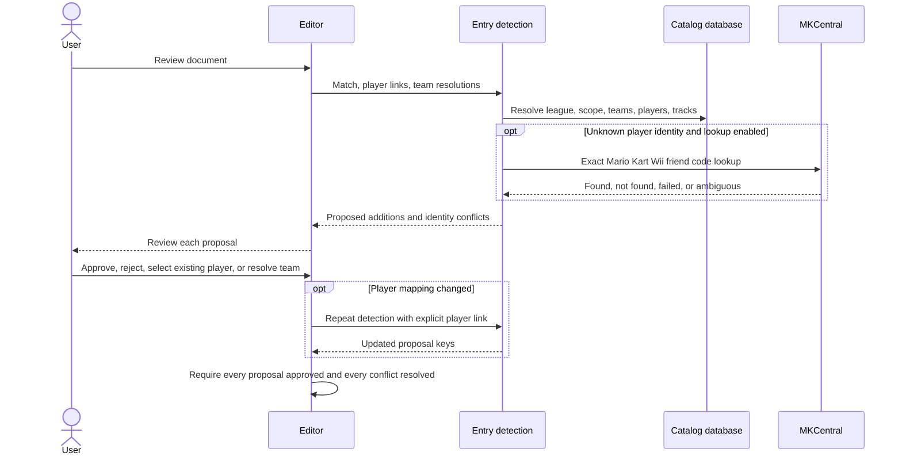
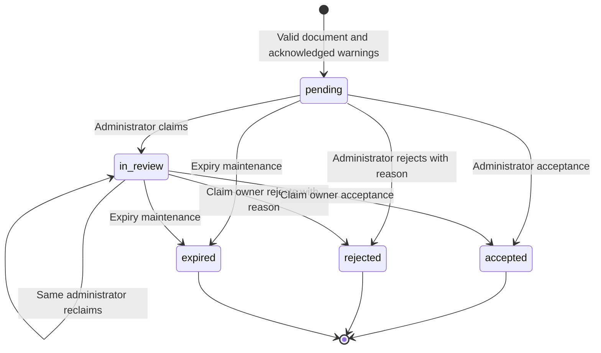
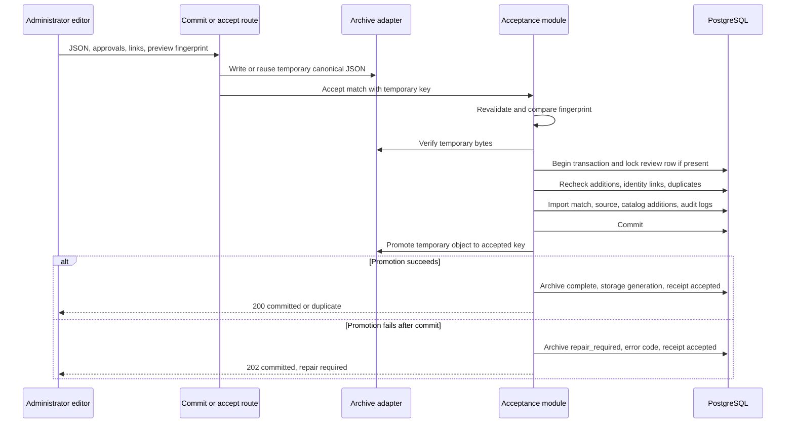

# JSON editor workflow

Start with the [editor index](README.md). This guide follows one document from load to an accepted match and explains the alternative correction path. Source: [editor orchestration](../../frontend/src/features/match-editor/MatchJsonEditor.tsx), [queue routes](../../backend/routes/reviews.py), [match routes](../../backend/routes/admin.py), and [acceptance](../../backend/acceptance_service.py).

## 1. Load a document

| Entry path | Behavior |
| --- | --- |
| Blank draft | Starts with two team cards, 12 blank races, `5v5`, `played`, and the selected site league. Season, division, and match number still need input. |
| Upload JSON | Browser `FileReader` reads `.json` or `.txt` as text; the extension does not change the parser. |
| Paste JSON | Uses the same parser and reset path as a file. Empty paste is rejected. |
| Review queue | [AdminReviewQueuePage](../../frontend/src/pages/AdminReviewQueuePage.tsx) writes `{submissionId, filename, match}` to the `ctc-review-draft` session-storage key, then navigates to the editor. The editor restores that document and remembers the review submission ID. |
| Correct accepted match | `/json-editor?edit_match=<id>` loads `/api/admin/matches/<id>/management`, including the original JSON, manifest, and current source fingerprint. Administrator authentication is required. |

Only a single JSON object is accepted by the interactive editor. Historical batch arrays are handled by the archive importer, not this screen. Loading file/paste data applies the current site league; changing the site league also updates the draft league. Historical numeric `week` becomes `match_number`, and `week` is removed.

Reset clears preview, approvals, identity state, warnings acknowledgement, receipt, and pending review handoff. File reads and asynchronous preview/commit work compare an editor version to avoid applying results to a subsequently loaded or cleared document. Clear and exit-edit actions ask for confirmation. A browser refresh is not a general draft-save feature: session storage is used for the review-queue handoff, not continuous autosave.

## 2. Edit and compile

The screen keeps match metadata/team/player facts in `match`, and ordered race editing state in `races`. `compileMatch(match, races)` derives the JSON shown in **Generated JSON Preview**, downloaded by **Download JSON**, and sent to the backend. It recalculates positions, scores, roles, GP groups, totals, table text, and missing-player awards. See [JSON format](json-format.md).

The editor supports team scope selection, roster reuse, player moves between teams, identity/friend-code correction, race placement by drag/drop or selection, room-size changes, disconnection awards, missing-player awards, penalties, regular/playoff metadata, and special results. Moving or renaming a player updates race references along with the player card. Removing a player removes that player's placements and disconnection awards. Shrinking a room preserves only placement slots still inside the room. Inserting/deleting races shifts subsequent race numbers; deleting requires confirmation and preserves at least one race. Race-count resizing clamps to 1–99. Deleting a team confirms removal of its players, placements, disconnection awards, missing-player awards, and identity links. Applying a missing-player award to all or remaining races replaces that team’s existing awards in the affected races.

Catalog requests enrich validation; they do not replace the draft's historical names or race facts. A team assignment differing from recorded participation warns for review instead of automatically moving the player. Download is available during editing and does not require a valid/server-previewed document.

## 3. Resolve proposed additions

**Review & Upload** first calls the new-entry detection route. Browser errors, an in-flight membership check, missing edit-source fingerprint, an active preview, or an already committed draft disable this action.

Entry keys identify the exact proposal being approved. A new friend code can be linked to an existing player or explicitly create a new identity. Conflicting player candidates require resolution; approving the conflict alone is insufficient. Matching team tags in another league require an explicit **link** to a candidate global team or **create** a separate team. Changing a player mapping reruns detection and clears the affected old approval decisions.

Public users can review proposals to obtain a rollback preview. These choices do not grant write access and are not accepted catalog changes. Queue submission sends the compiled match and warning acknowledgement, not the editor's proposed identity-link or entry-approval maps. The administrator redoes detection and approval against current database state.

## 4. Generate a server preview

`POST /api/matches/preview` creates canonical document bytes, runs committable validation, repeats entry detection/approval checks, imports inside a transaction, reads the normal match detail, and rolls back. It returns the rendered table data plus fingerprint, logical archive path, and new-entry list. No accepted archive is written, and no imported row from that transaction is retained. PostgreSQL-generated IDs used during the preview are temporary observations, not promised IDs for acceptance.

The preview uses the same importer as acceptance, which catches database constraints and competition rules that local validation cannot prove. Network lookup calls may still occur during detection/preview. The preview table offers the same traditional/vertical/charts/track views as match history.

A preview is not a durable token or a reservation of database state. Its fingerprint is a checksum of canonical proposed JSON. Acceptance compares that checksum with the submitted document and reruns current checks. If document content changes after preview, generate a new preview. Discard preview clears its metadata and table.

## 5. Submit for administrator review

Anonymous users submit to `POST /api/review-submissions`; authenticated users can use `POST /api/admin/review-submissions`. Both require warning acknowledgement when the server finds warnings. The authenticated path records the actor and bypasses the anonymous network rate limit.

The server revalidates the document and detects additions. It stores canonical JSON under `queue/pending/<uuid>.json`, creates a `ReviewSubmission` with status `pending`, and returns a minimal receipt (ID/status/timestamps/expiry). This does not add a match, team, player, or race to analytics. An identical active submission returns its existing receipt.

Claim/reject/accept checks lock the review row and prevent another administrator from acting on someone else's claim. A claim is optional before acceptance; acceptance can claim an unclaimed item. Rejection requires a nonblank reason and attempts to remove the temporary object. Maintenance retries terminal-object deletion. Pending and in-review submissions expire after 30 days; expiry is applied by maintenance, not by a browser timer. The database also permits status `failed`, but the current route/maintenance flow shown here does not assign it.

## 6. Accept a reviewed match or upload directly

Direct upload uses `POST /api/matches/commit`; queued acceptance uses `POST /api/admin/review-submissions/<id>/accept`. Both require an active administrator and call `accept_match`.

The import transaction writes match-owned records, any approved catalog additions, `SourceFile`, database addition logs, and administrator audit. An exact existing source is idempotent: the response is `duplicate`, and an incomplete archive may be repaired. A conflicting logical source path is rejected. Reusing a nonblank `rxx` table reference from another match in the same season/division is also rejected; regular match number alone is not a global or scope-wide uniqueness check.

Archive promotion follows commit so unaccepted data never becomes accepted archive data. A promotion failure does **not** roll back the accepted match. The UI can receive `archive_status: repair_required`; analytics already contains the match. Re-submitting blindly is unnecessary: maintenance reconstructs canonical JSON from accepted `Match.raw_json`, checks its stored fingerprint, and retries promotion. See [phase3_maintenance.py](../../backend/phase3_maintenance.py).

After success, the editor updates the table and additions list, refreshes scope/team/track catalogs, and clears a consumed review handoff. The administrator additions list polls every 15 seconds while the document is visible; it is not a streaming connection.

## 7. Correct an accepted match

Edit mode uses dedicated administrator routes. It retains the match ID and source identity while replacing match-owned results transactionally. It is not a second new-match upload.

1. Load original JSON and `source_fingerprint` from the management route.
2. Detect additions through `/api/admin/matches/<id>/new-entries`, with the existing match temporarily removed inside a rolled-back transaction.
3. Preview through `/api/admin/matches/<id>/preview`; `replace_match` checks the original source fingerprint and returns a structural change summary, record counts, references, preserved shared records, and proposed additions. Preview then rolls back.
4. Review the summary or download the edit-review report. Replacement row IDs are deliberately omitted from the report because preview IDs do not survive rollback.
5. `PATCH /api/admin/matches/<id>` first compares the preview fingerprint, preserves old JSON under `replaced/matches/<id>/...`, and stages the replacement bytes. These storage writes happen before the replacement transaction; a failure here leaves the accepted match unchanged.
6. Inside the replacement transaction, compare the original source fingerprint, lock the match, validate again, and commit the replacement.
7. Promote the staged replacement into the accepted archive. Only a promotion failure after commit follows the `repair_required` pattern: the updated match remains visible. Obsolete accepted-object cleanup after successful promotion is best effort.

A source containing multiple historical matches cannot be edited through this path. Reload is required if another change invalidates the original source fingerprint. Replacement preserves global teams/players/tracks and competition setup; provenance maintenance may prune unsupported importer-created player catalog associations, such as aliases, codes, or participation rows that were supported only by the removed facts. See [match_management.py](../../backend/match_management.py) and its workflow tests before extending correction behavior.

## Failure handling and environment behavior

| Failure | Result and next action |
| --- | --- |
| Invalid file/paste shape | Current document is retained; fix input and load again. |
| Catalog/network issue | UI exposes relevant errors or skips lookup-dependent checks; server preview remains authoritative. See [validation](validation.md). |
| New entry rejected/unresolved | No preview or acceptance until corrected/resolved. |
| Preview import/database failure | Transaction rolls back; correct the reported data issue and preview again. |
| Anonymous submission limit | HTTP 429; wait for the configured window. |
| Stale preview or edit source | Regenerate preview, or reload accepted match when source changed. |
| Acceptance failure before commit | Transaction rolls back; no accepted match. |
| Archive failure after commit | Accepted match remains visible; run archive repair. |

Local storage and GCS are adapters at the same archive seam. Staging/production must use durable configured storage; neither the editor nor this cleanup promotes staging data or changes deployment state. Read [ADR 0004](../adr/0004-administrator-access-and-public-review-queue.md) before altering queue retention, permissions, or acceptance ordering.
