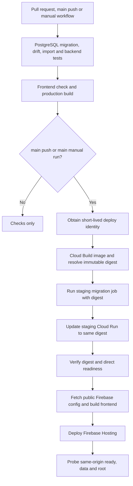

# Operations

The repository currently targets **staging**. Production cutover has not been
established by this cleanup. Commands in operational runbooks can mutate managed
resources; ordinary development and verification use local disposable state.

## Runbooks and ownership

| Need | Source |
| --- | --- |
| Runtime and browser configuration | [Environment and secrets](environment-and-secrets.md) |
| Understand the release sequence | [Deployment](deployment.md), [CI workflow](../../.github/workflows/ci-staging.yml) |
| Inspect recorded staging resources | [Dated resource inventory](phase-4-resource-inventory.md) |
| Read-only human SQL access | [Cloud SQL access](cloud-sql-read-access.md) |
| Review integrity findings | [Database-health dashboard](database-health-dashboard.md) |
| Repair archive state or expire queue entries | [Maintenance command catalog](../../backend/scripts/README.md) |
| Configure IAM/WIF and provider resources | [Infrastructure runbooks](../../infra/README.md) |
| Retire external legacy integrations | [Legacy integration cleanup](legacy-deployment-cleanup.md) |
| Plan restore/rollback and production release | [Production gates](../roadmap/README.md) |

## Release sequence implemented in CI

Deployments are serialized separately from test runs. The runtime container does
not run migrations on startup. Image rollback and database rollback are different
operations; this workflow does not automatically reverse a migrated schema.

## Failure triage

| Observation | Inspect first | Meaning |
| --- | --- | --- |
| Liveness fails | Cloud Run/Gunicorn startup and request logs | Process/routing failure; no database-read guarantee |
| Readiness fails | Database configuration/connectivity and migration revision | Runtime cannot satisfy database/schema readiness |
| Data health reports findings | Admin health details and source/archive state | The application can run while data needs review |
| Accepted response has archive repair pending | Source archive status, staging object, maintenance output | Database commit survived; object promotion must be retried |
| Review submission exists but statistics are unchanged | Queue status and administrator decision | Pending submission is not accepted data |
| Google sign-in succeeds but writes are forbidden | Backend audience, active administrator status/role | Identity and application authorization are separate |

Public health summaries intentionally omit sensitive record details. Administrators
use detailed health and audit views. Dismissing a finding records a decision; it
must not be described as correcting the underlying match.

Scheduled maintenance, alerting, logical export automation, restore drills, and
production rollout are tracked as pending gates in the [roadmap](../roadmap/README.md).
The presence of a maintenance script is not evidence that a scheduler runs it.
