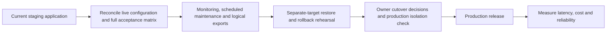

# Staging and future work

The application is still in staging. The checked-in workflow deploys `main` to
staging; this repository cleanup does not perform a deployment or certify live
cloud state. Accepted platform decisions remain in [ADRs](../adr/README.md).

## Read the records by their purpose

- [Production-readiness plan](production-readiness-plan.md): original phased plan
  and dated progress review. Completed phases and historical cost estimates are
  retained as context, not current measurements.
- [Resource inventory](../operations/phase-4-resource-inventory.md): dated cloud
  evidence and remaining operational checkpoints. Reconcile it before cutover.
- [Feature wishlist](feature-wishlist.md): historical product ideas, several now
  implemented. Read current feature guides before opening a new task.
- GitHub Issues: current actionable specifications, ownership, and dependencies.
  See [issue workflow](../agents/issue-tracker.md).

## Production gates still needing evidence

| Gate | Evidence needed before claiming completion |
| --- | --- |
| Staging behavior | Current migration head, health, real administrator/anonymous flows, negative authorization, and representative regular/playoff/special-result/edit cases |
| Operations | Alert recipients, thresholds, scheduler identities/cadences, successful maintenance runs, and failure notifications |
| Recovery | Verified export retention, separate-target restore results, archive reconciliation, application rollback and migration compatibility |
| CI hardening | Dependency/secret scanning and scheduled dependency updates, plus confirmed branch/environment protections |
| Production release | Billing ownership, domain/TLS, isolated credentials/data/storage, upload freeze/cutover procedure, incident owner and rollback decision |

These are existing project directions, not functionality added by the cleanup.
Avoid replacing them with speculative infrastructure or claiming a capability is
complete merely because a script or configuration file exists.

## Architecture opportunities deferred deliberately

- The editor's large controller has tightly related draft, asynchronous catalog,
  and review state. A future workflow redesign should start with behavioral tests
  around those transitions; moving callbacks into many hooks alone adds little depth.
- Administrative routes cover several independent capabilities. Split them when
  a focused behavior change provides a clear test surface and preserves route contracts.
- The process-local analytics cache has no cross-instance invalidation mechanism.
  Revisit only alongside measured consistency/scale requirements and tests.
- Cloud SQL capacity/availability upgrades, heavier media distribution, and a
  separate production instance should follow observed operational needs and ADR review.

The current cleanup groups existing modules, centralizes actual shared policy,
removes proven dead code, and documents the deployed direction. It introduces no
new framework, storage tier, schema, or product behavior.
